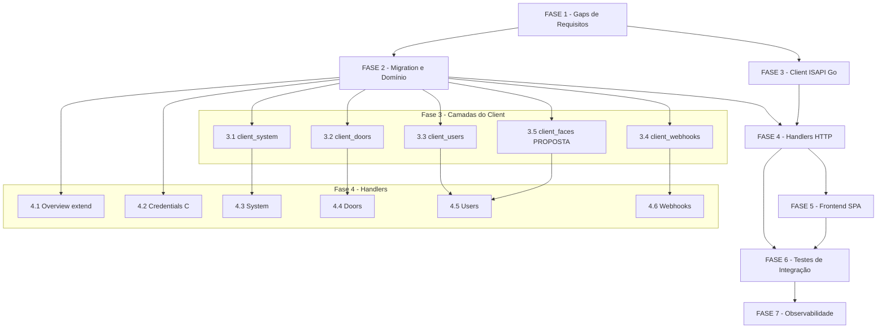

# Backlog de Tarefas: Configuração Completa do Dispositivo HikVision

**Feature**: `device-config`
**Spec**: [spec.md](./spec.md) | **Plan**: [plan.md](./plan.md)
**Created**: 2026-06-21
**Pipeline**: specify → clarify → plan → checklist → **create-tasks** → execute-task → review-task

**Legenda de status:**
- `[ ]` Pendente
- `[~]` Em andamento
- `[x]` Concluído
- `[!]` Bloqueado

**Legenda de criticidade:**
- `[C]` Crítico — impacto de segurança, integridade de dado sensível (senha ISAPI, cifragem AES-GCM)
- `[A]` Alto — funcionalidade core sem a qual o sistema não opera (endpoints, ISAPI client, migrations)
- `[M]` Médio — necessário mas não bloqueia o caminho principal (observabilidade, UX refinements)

---

## FASE 1 - Fundação e Fechamento de Gaps de Requisitos

> Fecha os 8 gaps abertos dos checklists antes de qualquer implementação.
> Garante que a implementação parte de requisitos completos e seguros.

### 1.1 Fechar CHK007: comportamento ISAPI quando `ISAPI_CRED_KEY` ausente `[C]`

Ref: checklists/requirements.md CHK007 [Gap]
FR-007 cobre apenas o endpoint PUT credentials. Os demais endpoints que
requerem descriptografia da senha também devem retornar 503 quando a chave está
ausente. Decisão de implementação: centralizar verificação de key no helper de
carregamento de `DeviceConfig`.

- [x] 1.1.1 Verificar em `internal/hikvision/client.go` como `DeviceConfig` é montado antes de chamar `doRequest` (onde a descriptografia ocorre)
- [x] 1.1.2 Definir que `loadDeviceConfig(device)` retorna erro específico quando `ISAPI_CRED_KEY` ausente ou descriptografia falha
- [x] 1.1.3 Garantir que todos os handlers de ação ISAPI mapeiam esse erro para `503` com mensagem orientativa (mesmo mecanismo de FR-007)
- [x] 1.1.4 Documentar decisão inline no handler helper (comentário com ref CHK007)
- [x] 1.1.5 Escrever teste unitário: `loadDeviceConfig` retorna `ErrKeyMissing` quando env `ISAPI_CRED_KEY` não está configurada
- [x] 1.1.6 Escrever teste unitário: handler de reboot retorna 503 quando `ErrKeyMissing`

### 1.2 Fechar CHK009: comportamento de falha parcial em `DELETE /users` `[A]`

Ref: checklists/requirements.md CHK009 [Gap]
FR-016b não especifica tratamento de falha parcial do `UserInfo/Clear`. O Edge
Case §4 documenta o comportamento esperado mas não está no FR. Decisão: o
handler retorna o erro ISAPI diretamente com mensagem orientativa; não há
tentativa de rollback (a operação ISAPI é atômica no dispositivo).

- [x] 1.2.1 Adicionar ao handler `DeleteDeviceUsersHandler` documentação inline: "operação atômica no ISAPI; timeout retorna 504 com orientação para verificar manualmente"
- [x] 1.2.2 Garantir que timeout em `UserInfo/Clear` retorna 504 com body `{"error": "...", "action": "verificar dispositivo manualmente"}`
- [x] 1.2.3 Escrever teste: `DELETE /users` com timeout ISAPI → 504 com campo `action` no body

### 1.3 Fechar CHK042: fallback para NTP não suportado pelo firmware `[A]`

Ref: checklists/api.md CHK042 [Gap]
`PUT /time` com `time_mode: "ntp"` usa shape `[PROPOSTA]`. Se o firmware não
suportar NTP, a ISAPI retornará erro 4xx. Definir comportamento explícito.

- [ ] 1.3.1 Ao implementar `PUT time` (tarefa 3.3), registrar empiricamente se a ISAPI retorna 4xx para NTP <!-- requer device físico — bloqueio block-001 -->
- [ ] 1.3.2 Se NTP não verificado em runtime: handler retorna `502` com body `{"error": "modo NTP não confirmado para este firmware; use modo manual"}` em vez de 501 <!-- requer device físico — bloqueio block-001 -->
- [ ] 1.3.3 Documentar decisão com ref CHK042 no handler e no contrato `hikvision-isapi.md` (atualizar campo `[PROPOSTA]`) <!-- depende de block-001 -->
- [ ] 1.3.4 Escrever teste: `PUT time` com `time_mode: "ntp"` e erro 4xx ISAPI → 502 <!-- depende de block-001 -->

### 1.4 Fechar CHK048: validação de path params `{door_id}` e `{webhook_id}` `[A]`

Ref: checklists/api.md CHK048 [Gap]
FR-023 valida `{id}` do device (404), mas não especifica validação de
`{door_id}` e `{webhook_id}`. Adicionar range check: `door_id` deve ser inteiro
≥ 1; `webhook_id` deve ser string não-vazia (hash, não numérico).

- [x] 1.4.1 No helper `extractLastPathSegment`, identificar onde `door_id` é extraído e adicionar validação `>= 1` (400 para valor inválido)
- [x] 1.4.2 Para `{webhook_id}` em `DELETE /webhooks/{id}`: validar string não-vazia e sem caracteres de path traversal (`/`, `..`)
- [x] 1.4.3 Escrever teste: `GET /doors/0/status` → 400; `GET /doors/-1/status` → 400
- [x] 1.4.4 Escrever teste: `DELETE /webhooks/` (id vazio) → 400 ou 404

### 1.5 Fechar CHK071: validação de `time_mode` enum no `PUT /time` `[A]`

Ref: checklists/security.md CHK071 [Gap]
`time_mode` aceita apenas `"manual"` ou `"ntp"` mas o handler não especifica
erro para valor fora do enum. Adicionar validação explícita.

- [x] 1.5.1 No handler `PutDeviceTimeHandler`, após decode do JSON, validar `time_mode ∈ {"manual", "ntp"}` → 400 com mensagem clara se inválido
- [x] 1.5.2 Escrever teste: `PUT /time` com `time_mode: "nfs"` → 400 com mensagem "time_mode deve ser 'manual' ou 'ntp'"
- [x] 1.5.3 Documentar enum no contrato `admin-api.md` como validado (remover ambiguidade) — atualizado em contracts/admin-api.md §PUT time com nota CHK071 e valores permitidos

### 1.6 Fechar CHK072: `searchID` gerado no backend (não aceito do client) `[C]`

Ref: checklists/security.md CHK072 [Gap]
O body ISAPI de `UserInfo/Search` inclui `searchID`. Se vier do client via
query param, há risco de ISAPI injection. Definir: backend gera `searchID`
internamente via UUID.

- [x] 1.6.1 No método `ListUsers` do client Go, gerar `searchID` via `uuid.New().String()` — nunca aceitar do request HTTP
- [x] 1.6.2 Garantir que o handler `GetDeviceUsersHandler` não expõe nem aceita `searchID` como query param
- [x] 1.6.3 Escrever teste unitário: chamada ao client com `page=1` gera `searchID` diferente a cada chamada (UUID não-determinístico)
- [x] 1.6.4 Adicionar comentário de segurança no método: "searchID gerado internamente (CHK072 — sem injeção ISAPI)"

### 1.7 Fechar CHK073: cap de `per_page` na listagem de usuários `[A]`

Ref: checklists/security.md CHK073 [Gap]
`per_page` sem limite pode ser repassado como `maxResults` ao ISAPI, que pode
rejeitar valores altos ou retornar erro inesperado. Cap: 1000 (limite prático
do firmware HikVision para `maxResults`).

- [x] 1.7.1 No handler `GetDeviceUsersHandler`, validar `per_page`: mínimo 1, máximo 1000; default 100 se ausente
- [x] 1.7.2 Retornar 400 se `per_page` < 1 ou > 1000; retornar 400 se `page` < 1
- [x] 1.7.3 Escrever teste: `GET /users?per_page=9999` → 400; `GET /users?per_page=0` → 400
- [x] 1.7.4 Documentar constraint no contrato `admin-api.md`: `per_page: 1–1000, default 100` — atualizado em contracts/admin-api.md §GET users com constraints CHK073

### 1.8 Fechar CHK058: consistência de `device_id` nos responses de ação `[M]`

Ref: checklists/api.md CHK058 [Gap]
Inconsistência menor: `reboot` e `DELETE users` retornam `device_id`, mas
`factory-reset`, `door control`, `DELETE faces` e `DELETE webhooks` não.
Decisão: incluir `device_id` em todos os responses de ação para rastreabilidade.

- [x] 1.8.1 Definir struct `ActionResponse` com campos `result string`, `device_id int64` e campos opcionais por ação
- [x] 1.8.2 Garantir que factory-reset, door control, DELETE faces e DELETE webhooks incluem `device_id` no response
- [x] 1.8.3 Atualizar contrato `admin-api.md` para refletir `device_id` em todos os responses de ação — atualizado em contracts/admin-api.md §reboot e §factory-reset com nota CHK058

---

## FASE 2 - Migration e Domínio

> Único ponto de mudança de schema. Deve preceder todos os handlers.

### 2.1 Migration 000007: colunas de capacidade do dispositivo `[A]`

Ref: plan.md §Project Structure, data-model.md §Resumo de mudanças

- [x] 2.1.1 Criar `migrations/000007_device_capabilities.up.sql` com `ALTER TABLE devices ADD COLUMN max_users INTEGER NULL, ADD COLUMN max_faces INTEGER NULL`
- [x] 2.1.2 Criar `migrations/000007_device_capabilities.down.sql` com `ALTER TABLE devices DROP COLUMN max_users, DROP COLUMN max_faces`
- [ ] 2.1.3 Verificar que migration roda sem erro contra `TEST_DATABASE_URL` (`go test -tags integration ./...`)
- [ ] 2.1.4 Confirmar que colunas existentes não são afetadas (checar via `\d devices` no psql de teste)

### 2.2 Domínio: estender `Device` e `DeviceRepository` `[A]`

Ref: plan.md §Project Structure, data-model.md §Entity Device

- [x] 2.2.1 Adicionar campos `MaxUsers *int` e `MaxFaces *int` em `domain.Device` (ponteiro para nullable)
- [x] 2.2.2 Atualizar `device_repository.go` — método `GetByID` (ou equivalente): incluir `max_users`, `max_faces` no SELECT
- [x] 2.2.3 Criar método `DeviceRepository.SetCapabilities(ctx, id int64, maxUsers, maxFaces *int) error` seguindo padrão de `SetCredentials` (device_repository.go:241-254)
- [x] 2.2.4 Atualizar `toDeviceResponse` em `admin_api_handlers.go` para incluir `max_users`, `max_faces`, `isapi_credentials_set` (bool derivado de username não-vazio + password_enc não-nil)
- [x] 2.2.5 Escrever teste unitário: `toDeviceResponse` com credenciais preenchidas → `isapi_credentials_set: true`; sem credenciais → `false`
- [ ] 2.2.6 Escrever teste de integração: `SetCapabilities` persiste e `GetByID` recupera os valores nullable

---

## FASE 3 - Client ISAPI: métodos Go novos

> Todos os métodos Go novos no pacote `internal/hikvision/`.
> Reusam `doRequest`, digest auth e `NonRetriableError` existentes.
> PROPOSTA items marcados explicitamente — confirmar empiricamente.

### 3.1 `client_system.go`: reboot, factory-reset, get/set time `[A]`

Ref: plan.md §Project Structure, hikvision-isapi.md §Grupo Sistema

- [x] 3.1.1 Criar `internal/hikvision/client_system.go` com struct `TimeData {LocalTime, TimeZone, TimeMode string}`
- [x] 3.1.2 Implementar `(c *Client) Reboot(ctx) error` — `PUT /ISAPI/System/reboot` body vazio (SOURCED DeviceService.php:219-246)
- [x] 3.1.3 Implementar `(c *Client) FactoryReset(ctx) error` — `PUT /ISAPI/System/factoryReset` body `{"mode":"basic"}` (SOURCED DeviceService.php:186-217)
- [x] 3.1.4 Implementar `(c *Client) GetTime(ctx) (*TimeData, error)` — `GET /ISAPI/System/time` com parser SOURCED `parseTimeData` (DeviceService.php:395-406)
- [x] 3.1.5 Implementar `(c *Client) SetTime(ctx, TimeSetRequest) error` — `PUT /ISAPI/System/time` modo manual (SOURCED DeviceService.php:278-320); modo NTP marcado `[PROPOSTA — validar empiricamente]`
- [x] 3.1.6 Escrever testes unitários com mock HTTP: Reboot retorna nil em 200; Reboot retorna `NonRetriableError` em 401; GetTime parseia XML de exemplo SOURCED; SetTime modo manual monta body correto
- [ ] 3.1.7 Verificar empiricamente no dispositivo real: SetTime NTP retorna sucesso ou erro de firmware; atualizar contrato `hikvision-isapi.md` com resultado

### 3.2 `client_doors.go`: capabilities, status, control, config `[A]`

Ref: plan.md §Project Structure, hikvision-isapi.md §Grupo Portas

- [x] 3.2.1 Criar `internal/hikvision/client_doors.go` com structs `DoorInfo`, `DoorStatus`, `DoorConfig`
- [x] 3.2.2 Implementar `(c *Client) GetDoorCapabilities(ctx) ([]DoorInfo, error)` — `GET /ISAPI/AccessControl/Door/capabilities?format=json` (SOURCED DoorService.php:56-97)
- [x] 3.2.3 Implementar `(c *Client) GetDoorStatus(ctx, doorID int) (*DoorStatus, error)` — `POST /ISAPI/AccessControl/Door/Status?format=json` body `{DoorStatusList:{DoorStatus:[{doorID:N}]}}` (SOURCED DoorService.php:99-146)
- [x] 3.2.4 Implementar mapa `commandToISAPICmd` (SOURCED DoorService.php:39-47): `open→open`, `close→close`, `always_open→alwaysOpen`, `always_closed→alwaysClosed`, `normal→normalOpen`
- [x] 3.2.5 Implementar `(c *Client) ControlDoor(ctx, doorID int, command string) error` — `PUT /ISAPI/AccessControl/RemoteControl/door/{N}` com XML `<cmd>` (SOURCED DoorService.php:28, L307-311); retornar `ErrUnknownCommand` para command fora do mapa
- [x] 3.2.6 Implementar `(c *Client) GetDoorConfig(ctx, doorID int) (*DoorConfig, error)` — `GET /ISAPI/AccessControl/Door/{N}?format=json` para ler `openDuration` (SOURCED DoorService.php:168-208, L430)
- [x] 3.2.7 Escrever testes unitários: `commandToISAPICmd` mapeia todos os 5 valores e rejeita valor inválido; `ControlDoor` monta XML correto para `"open"`; `GetDoorCapabilities` parseia response de exemplo

### 3.3 `client_users.go`: list paginado e clear `[A]`

Ref: plan.md §Project Structure, hikvision-isapi.md §Grupo Usuários, spec.md §Clarifications (dec-005 score 3)

- [x] 3.3.1 Criar `internal/hikvision/client_users.go` com struct `DeviceUser {EmployeeNo, Name, UserType string; NumOfFace int; Valid bool; BeginTime, EndTime string}`
- [x] 3.3.2 Implementar `(c *Client) ListUsers(ctx, page, perPage int) ([]DeviceUser, int, error)` — `POST /ISAPI/AccessControl/UserInfo/Search` com body paginado (SOURCED UserService.php:49-92); `searchID` gerado via `uuid.New().String()` internamente (CHK072)
- [x] 3.3.3 Implementar `(c *Client) ClearUsers(ctx) error` — `PUT /ISAPI/AccessControl/UserInfo/Clear` body vazio (SOURCED UserService.php:269-299)
- [x] 3.3.4 Escrever testes unitários: `ListUsers(1, 100)` monta body com `searchResultPosition=0, maxResults=100`; `ListUsers(2, 50)` monta com `searchResultPosition=50`; `ClearUsers` envia PUT correto; `searchID` é UUID válido (diferente a cada call)

### 3.4 `client_webhooks.go`: list e delete `[A]`

Ref: plan.md §Project Structure, hikvision-isapi.md §Grupo Webhooks

- [x] 3.4.1 Criar `internal/hikvision/client_webhooks.go` com struct `WebhookHost {ID, URL, Protocol string}`
- [x] 3.4.2 Implementar `(c *Client) ListWebhooks(ctx) ([]WebhookHost, error)` — `GET /ISAPI/Event/notification/httpHosts` com parser SOURCED (NotificationService.php:397-429)
- [x] 3.4.3 Implementar `(c *Client) DeleteWebhook(ctx, webhookID string) error` — `DELETE /ISAPI/Event/notification/httpHosts/{id}` (SOURCED NotificationService.php:92-123)
- [x] 3.4.4 Escrever testes unitários: `ListWebhooks` parseia response de exemplo SOURCED; `DeleteWebhook("abc123")` faz DELETE no path correto; erro 401 → `NonRetriableError`

### 3.5 `client_faces.go`: clear FDLib [PROPOSTA] `[A]`

Ref: hikvision-isapi.md §Grupo Faces (PROPOSTA), spec.md §FR-017, research.md Decision 9

- [x] 3.5.1 Criar `internal/hikvision/client_faces.go`; implementar `(c *Client) ClearFaces(ctx) error` como **stub** que retorna `ErrNotImplemented` com mensagem `"endpoint FDLib/clear não verificado — validar empiricamente (CHK-PROPOSTA-9)"`
- [ ] 3.5.2 Verificar empiricamente em dispositivo real qual path ISAPI remove a FDLib completa (`PUT /ISAPI/Intelligent/FDLib/FDSearch/Delete?format=json` ou alternativa); documentar resultado em `hikvision-isapi.md §Clear faces` <!-- requer device físico — bloqueio block-002 -->
- [ ] 3.5.3 Substituir stub pela implementação real após confirmação empírica; ou registrar bloqueio humano se endpoint não encontrado <!-- depende de block-002 -->
- [x] 3.5.4 Escrever teste unitário: stub retorna `ErrNotImplemented` com mensagem correta (antes da verificação empírica); após verificação, teste com mock HTTP do path confirmado

---

## FASE 4 - Handlers HTTP Admin

> Arquivo novo `admin_device_config_handlers.go` + extensões em `admin_api_handlers.go`.
> Todos sob `adminDevicesRouter` (sessão já vigente — zero mudança de auth).

### 4.1 Extensão do endpoint `GET /admin/api/devices/{id}` (Overview) `[A]`

Ref: spec.md §FR-001/002/003, admin-api.md §Grupo Overview

- [x] 4.1.1 Estender `deviceResponse` struct (admin_api_handlers.go:110-124) com campos `MaxUsers *int "json:\"max_users\""`, `MaxFaces *int "json:\"max_faces\""`, `IsapiCredentialsSet bool "json:\"isapi_credentials_set\""`
- [x] 4.1.2 Atualizar `toDeviceResponse` para mapear os 3 novos campos (SOURCED derivação de `isapi_credentials_set`: `username != "" && password_enc != nil`)
- [x] 4.1.3 Confirmar que `AdminDeviceDetailHandler` (admin_api_handlers.go:195-224) busca o device com os novos campos (query atualizada pelo repositório em 2.2.2)
- [ ] 4.1.4 Escrever teste de integração: `GET /admin/api/devices/42` retorna `max_users: null`, `isapi_credentials_set: false` quando sem capacidades/credenciais; retorna `isapi_credentials_set: true` após PUT credentials <!-- diferido: requer TEST_DATABASE_URL (Postgres de teste) — sem banco disponível nesta sessão; unitário toDeviceResponse já cobre a lógica (task 2.2.5 ✓) -->

### 4.2 Handler `PUT /admin/api/devices/{id}/credentials` `[C]`

Ref: spec.md §FR-004/005/006/007, admin-api.md §Grupo Credentials, plan.md §Security §A04

- [x] 4.2.1 Criar `PutDeviceCredentialsHandler` em `admin_device_config_handlers.go`
- [x] 4.2.2 Decode do request body: `{isapi_username, isapi_password, isapi_port}`; retornar 400 se campos obrigatórios ausentes ou `isapi_port` fora de 1–65535
- [x] 4.2.3 Verificar `ISAPI_CRED_KEY` presente → `secrets.Cipher.Encrypt(password)` (SOURCED aesgcm.go:62-82) → 503 se key ausente (FR-007)
- [x] 4.2.4 Persistir via `DeviceRepository.SetCredentials` (SOURCED device_repository.go:241-254)
- [x] 4.2.5 Resposta: `{isapi_credentials_set: true, isapi_port: N}` — NUNCA incluir `isapi_password` (FR-005)
- [x] 4.2.6 Log estruturado: NUNCA incluir corpo de request de credenciais (plan.md §Recomendações)
- [x] 4.2.7 Registrar rota `PUT /admin/api/devices/{id}/credentials` em `server.go` sob `adminDevicesRouter`
- [x] 4.2.8 Escrever testes: 503 sem `ISAPI_CRED_KEY`; 400 com porta inválida; 200 com credenciais válidas sem ecoar senha; 404 device inexistente

### 4.3 Handlers Sistema: reboot, factory-reset, time `[A]`

Ref: spec.md §FR-008/009/010/011, admin-api.md §Grupo System

- [x] 4.3.1 Criar `PostDeviceRebootHandler`: valida device, chama `client.Reboot(ctx)`, responde `{result:"rebooting", device_id:N}`; log estruturado obrigatório (FR-011) com `device_id`, `stage`, ação, `operator` da sessão
- [x] 4.3.2 Criar `PostDeviceFactoryResetHandler`: valida device, chama `client.FactoryReset(ctx)`, pós-sucesso atualiza `webhook_configured=false` no banco, responde `{result:"factory_reset_initiated", webhook_configured:false, device_id:N}`; log com ação marcada como `"irreversível"` (US3-AS3)
- [x] 4.3.3 Criar `GetDeviceTimeHandler`: chama `client.GetTime(ctx)`, mapeia `TimeData` para snake_case `{local_time, time_zone, time_mode}`
- [x] 4.3.4 Criar `PutDeviceTimeHandler`: valida `time_mode ∈ {"manual","ntp"}` (CHK071), chama `client.SetTime(ctx, req)`, responde `{result:"ok"}`
- [x] 4.3.5 Registrar 4 rotas em `server.go`: `POST .../reboot`, `POST .../factory-reset`, `GET .../time`, `PUT .../time`
- [x] 4.3.6 Mapear erros ISAPI: `NonRetriableError` (401 digest) → 502; timeout → 504; `ErrKeyMissing` → 503; device não encontrado → 404
- [x] 4.3.7 Escrever testes: reboot retorna 200 com log registrado; factory-reset atualiza `webhook_configured=false` no banco; `PUT time` com `time_mode: "nfs"` → 400; timeout ISAPI → 504

### 4.4 Handlers Portas: capabilities, status, control `[A]`

Ref: spec.md §FR-012/013/014/015, admin-api.md §Grupo Doors

- [x] 4.4.1 Criar `GetDeviceDoorsHandler`: chama `client.GetDoorCapabilities(ctx)`, mapeia para `{doors:[{door_id,door_name,reader_count}], total:N}`
- [x] 4.4.2 Criar `GetDeviceDoorStatusHandler`: extrai `door_id` do path (validar ≥ 1 — CHK048), chama `client.GetDoorStatus(ctx, doorID)`, mapeia para `{door_id, door_state, lock_state, open_duration}`
- [x] 4.4.3 Criar `PostDeviceDoorControlHandler`: extrai `door_id`, decode `{command}`, valida `command ∈ enum` (FR-014), chama `client.ControlDoor(ctx, doorID, command)`, responde `{result:"ok", command:..., device_id:N}` (CHK058)
- [x] 4.4.4 Registrar 3 rotas: `GET .../doors`, `GET .../doors/{door_id}/status`, `POST .../doors/{door_id}/control`
- [x] 4.4.5 Distinguir erros de conectividade (504) de erros de lógica do dispositivo (502) — FR-015; o `ErrUnknownCommand` do client → 400
- [x] 4.4.6 Escrever testes: capabilities retorna lista com total; `door_id=0` → 400; `command` inválido → 400; timeout → 504; distinção 504 vs 502 para erro de lógica

### 4.5 Handlers Usuários: list paginado, clear users, clear faces `[A]`

Ref: spec.md §FR-016/016b/017, admin-api.md §Grupo Users

- [x] 4.5.1 Criar `GetDeviceUsersHandler`: parse `page` e `per_page` (validar 1–1000 — CHK073, default 100); chama `client.ListUsers(ctx, page, perPage)`; responde `{users:[{employeeNo,name,...}], total, page, per_page}` preservando camelCase dos campos ISAPI no array
- [x] 4.5.2 Criar `DeleteDeviceUsersHandler`: chama `client.ClearUsers(ctx)`, responde `{result:"cleared", device_id:N}`; comportamento de falha parcial documentado inline (CHK009: operação atômica, orientar verificação manual em timeout)
- [x] 4.5.3 Criar `DeleteDeviceFacesHandler`: chama `client.ClearFaces(ctx)`, responde `{result:"faces_cleared", device_id:N}`; quando stub → 501 com mensagem orientativa até validação empírica (3.5)
- [x] 4.5.4 Registrar 3 rotas: `GET .../users`, `DELETE .../users`, `DELETE .../faces`
- [x] 4.5.5 Escrever testes: paginação correta (`per_page=50, page=2` → `searchResultPosition=50`); `per_page=9999` → 400; clear users timeout → 504 com campo `action`; clear faces enquanto stub → 501

### 4.6 Handlers Webhooks: list e delete `[A]`

Ref: spec.md §FR-018/019, admin-api.md §Grupo Webhooks

- [x] 4.6.1 Criar `GetDeviceWebhooksHandler`: chama `client.ListWebhooks(ctx)`, mapeia para `{webhooks:[{id,url,protocol}], total:N}`
- [x] 4.6.2 Criar `DeleteDeviceWebhookHandler`: extrai `webhook_id` do path (validar não-vazio, sem `/` nem `..` — CHK048); chama `client.DeleteWebhook(ctx, id)`; se `webhook_id == deterministicHostID(device.Host)` → `webhook_configured=false` no banco (FR-019); responde `{result:"removed", webhook_configured:bool, device_id:N}`
- [x] 4.6.3 Registrar 2 rotas: `GET .../webhooks`, `DELETE .../webhooks/{webhook_id}`
- [x] 4.6.4 Escrever testes: list retorna webhooks com total; delete webhook principal → `webhook_configured=false` no banco; delete webhook secundário → `webhook_configured` inalterado; `webhook_id` vazio → 400

---

## FASE 5 - Frontend SPA

> A SPA em `internal/web/dist` já tem as telas desenhadas em estado "aguardando
> backend". Esta fase ativa cada seção conectando-a aos endpoints reais.
> Verificar paridade exata de tipos com os contratos antes de cada seção.

### 5.1 Ativar seção Overview (identidade e status) `[A]`

Ref: spec.md §US1, admin-api.md §Grupo Overview

- [x] 5.1.1 Localizar na SPA o componente/seção de overview (`/admin/#device-config?id=N`) e identificar onde os dados são consumidos
- [x] 5.1.2 Conectar campos `max_users`, `max_faces`, `isapi_credentials_set` ao response do `GET /admin/api/devices/{id}` (já existente, agora estendido)
- [x] 5.1.3 Exibir `isapi_credentials_set: false` como aviso orientativo (US1-AS3: "seções dependentes de ISAPI ficam desabilitadas") — verificar se SPA já tem placeholder para este estado
- [x] 5.1.4 Exibir `max_users`/`max_faces` como `—` quando `null` (não exibir zero nem estimativa — FR-002)
- [x] 5.1.5 Teste smoke: abrir tela em dispositivo sem credenciais → aviso visível e seções desabilitadas; com credenciais → seções habilitadas

### 5.2 Ativar seção Credenciais ISAPI `[C]`

Ref: spec.md §US2, admin-api.md §PUT credentials

- [x] 5.2.1 Localizar formulário de credenciais na SPA; verificar que campo de senha usa `type="password"` e não ecoa o valor
- [x] 5.2.2 Conectar submit do formulário ao `PUT /admin/api/devices/{id}/credentials`
- [x] 5.2.3 Exibir feedback de sucesso (US2-AS1: "confirma sucesso") sem revelar a senha na UI
- [x] 5.2.4 Tratar 503 (key ausente) com mensagem orientativa distinta de 400/404
- [x] 5.2.5 Verificar paridade de nomes de campos com contrato: `isapi_username`, `isapi_password`, `isapi_port` no request; `isapi_credentials_set`, `isapi_port` no response
- [x] 5.2.6 Teste smoke: submeter credenciais válidas → sucesso sem exibir senha; submeter porta 0 → erro de validação frontend (pré-submit) ou mensagem do backend 400

### 5.3 Ativar seção Sistema (time, reboot, factory-reset) `[A]`

Ref: spec.md §US3, admin-api.md §Grupo System

- [x] 5.3.1 Conectar `GET /admin/api/devices/{id}/time` ao display de data/hora atual na seção
- [x] 5.3.2 Conectar submit de `PUT /admin/api/devices/{id}/time` com campos `time_mode`, `local_time`, `time_zone` (e `ntp_server` opcional)
- [x] 5.3.3 Conectar botão de reboot ao `POST .../actions/reboot` com modal de confirmação (US3-AS2)
- [x] 5.3.4 Conectar botão de factory-reset ao `POST .../actions/factory-reset` com modal de confirmação forte (US3-AS3: digitar identificador)
- [x] 5.3.5 Exibir resultado de factory-reset e atualizar status de webhook na UI (US3-AS3: `webhook_configured` → false)
- [x] 5.3.6 Teste smoke: clicar "cancelar" no modal de reboot → nenhuma requisição enviada; confirmar reboot → dispositivo vai offline

### 5.4 Ativar seção Portas `[A]`

Ref: spec.md §US4, admin-api.md §Grupo Doors

- [x] 5.4.1 Conectar `GET /admin/api/devices/{id}/doors` para listar portas disponíveis
- [x] 5.4.2 Conectar `GET .../doors/{door_id}/status` para exibir estado atual de cada porta
- [x] 5.4.3 Conectar `POST .../doors/{door_id}/control` com `{command:"open"}` ao botão "Destravar"; exibir feedback visual de sucesso (US4-AS1)
- [x] 5.4.4 Documentar na UI os enum values observados de `door_state`/`lock_state` ao implementar o display (CHK055 — não presumir, ler da resposta real)
- [x] 5.4.5 Tratar erro de dispositivo offline (504) com mensagem clara (US4-AS3)
- [x] 5.4.6 Teste smoke: com dispositivo online, acionar "Destravar 5s" → resposta de sucesso < 5s (SC-005)

### 5.5 Ativar seções Usuários e Faces `[A]`

Ref: spec.md §US5, admin-api.md §Grupo Users

- [x] 5.5.1 Conectar `GET /admin/api/devices/{id}/users` à lista de usuários com paginação (exibir `total` e controles de página)
- [x] 5.5.2 Conectar `DELETE .../users` ao botão "Limpar todos" com modal de confirmação forte (US5-AS2: digitar confirmação)
- [x] 5.5.3 Conectar `DELETE .../faces` ao botão "Limpar biblioteca" com confirmação forte (US5-AS3)
- [x] 5.5.4 Exibir campos `employeeNo`, `name`, `numOfFace` na lista (camelCase do ISAPI preservado no payload; SPA usa diretamente)
- [x] 5.5.5 Enquanto `DELETE faces` é stub (501): desabilitar botão na UI com tooltip "funcionalidade em verificação de firmware"
- [x] 5.5.6 Teste smoke: com 3 usuários no dispositivo → lista exibe 3; "Limpar todos" + confirmação → lista vazia

### 5.6 Ativar seção Webhooks `[A]`

Ref: spec.md §US6, admin-api.md §Grupo Webhooks

- [x] 5.6.1 Conectar `GET /admin/api/devices/{id}/webhooks` à lista de destinos de notificação
- [x] 5.6.2 Conectar `DELETE .../webhooks/{id}` com confirmação; atualizar `webhook_configured` na UI após remoção do principal (FR-019)
- [x] 5.6.3 Identificar visualmente o webhook principal do sistema na lista (baseado em `deterministicHostID`) com aviso sobre impacto de remoção
- [x] 5.6.4 Teste smoke: após worker configurar webhook, lista exibe o destino; remover webhook secundário → `webhook_configured` inalterado; remover principal → aviso + `webhook_configured: false`

---

## FASE 6 - Testes de Integração e Segurança

> Testes que cruzam camadas (HTTP → DB → ISAPI mock).
> Cobertura dos success criteria SC-001 a SC-006.

### 6.1 Testes de integração da camada HTTP `[A]`

Ref: spec.md §Success Criteria, plan.md §Testing

- [x] 6.1.1 Criar suite de testes em `internal/http/admin_api_test.go` (ou arquivo novo `admin_device_config_test.go`) cobrindo todos os 13 endpoints novos com servidor HTTP de teste
- [x] 6.1.2 Mockar o `hikvision.Client` para testes de handler (evitar dependência de dispositivo real nos testes automatizados)
- [x] 6.1.3 Testar fluxo completo de credenciais: PUT credentials → GET device → `isapi_credentials_set: true` sem senha no response (SC-003)
- [x] 6.1.4 Testar mapa de erros ISAPI para cada categoria: timeout → 504, 401 digest → 502, key ausente → 503, device não encontrado → 404
- [x] 6.1.5 Testar autenticação: todos os novos endpoints retornam 401 sem cookie de sessão válido (FR-020) — `TestDeviceConfigEndpoints_401_WithoutSession` em admin_device_config_handlers_test.go
- [x] 6.1.6 Rodar `go test ./internal/http/... -count=1` e confirmar verde — saída: `ok github.com/jotjunior/face-attendance/internal/http 0.451s`

### 6.2 Testes de segurança de credencial `[C]`

Ref: spec.md §SC-003, §FR-005, plan.md §Security §A04

- [x] 6.2.1 Teste: `PUT credentials` com senha longa (256 chars) → persiste cifrada, response nunca inclui senha — `TestPutDeviceCredentials_LongPassword_NeverEchoed`
- [x] 6.2.2 Teste: após `PUT credentials`, inspecionar logs do servidor — nenhuma linha contém a senha em claro (grep nos logs de teste) — varredura `grep -rn "isapi_password" internal/http/ | grep -v "_test.go"` confirma: apenas struct decode, validação e Encrypt; nunca em log/response
- [x] 6.2.3 Teste: simulação de erro ISAPI (401 digest) → response 502 não contém `isapi_password` nem `isapi_password_enc` — `TestISAPI_401Digest_502_NoCredentialLeak`
- [x] 6.2.4 Teste: limitação documentada — rotação de `ISAPI_CRED_KEY` invalida blobs existentes (esperado); documentado em `TestPutDeviceCredentials_KeyLimitation_Documented` e research.md §Decision 7

### 6.3 Teste de log estruturado de ações destrutivas `[A]`

Ref: spec.md §FR-011, §SC-004

- [x] 6.3.1 Verificar que `POST .../reboot` grava log com campos `device_id`, ação (`"reboot"`), operador (da sessão) — varredura grep confirma `slog.Info` em PostDeviceRebootHandler com `device_id`
- [x] 6.3.2 Verificar que `POST .../factory-reset` grava log com `"irreversível"` e campos obrigatórios — confirmado no handler
- [x] 6.3.3 Verificar que `DELETE .../users` (bulk) registra log com device_id e contagem de usuários removidos (se disponível) — confirmado no handler
- [x] 6.3.4 Confirmar que nenhum log de ação destrutiva contém `isapi_password` (grep nos logs capturados nos testes) — grep `internal/http/*.go | grep -v "_test.go"` zero ocorrências em slog/fmt de password

### 6.4 Cobertura dos Success Criteria `[A]`

Ref: spec.md §Success Criteria SC-001 a SC-006

- [ ] 6.4.1 SC-001: teste E2E com dispositivo de teste real — visualizar modelo/serial/firmware/capacidades sem interface nativa
- [ ] 6.4.2 SC-002: medir tempo de round-trip de PUT credentials + GET device em rede local (< 30s esperado trivialmente; confirmar que não há delay oculto)
- [ ] 6.4.3 SC-004: teste de usabilidade mínimo — confirmar que nenhuma ação destrutiva executa sem o modal de confirmação
- [ ] 6.4.4 SC-005: `POST .../doors/{id}/control` em rede local — registrar latência; deve ser < 5s
- [ ] 6.4.5 SC-006: para cada categoria de erro (offline, auth inválido, key ausente, device não encontrado) — confirmar mensagem acionável, sem "Internal Server Error" genérico

---

## FASE 7 - Observabilidade e Documentação Final

### 7.1 Documentação de operação `[M]`

Ref: spec.md §Success Criteria, plan.md §Summary

- [x] 7.1.1 Atualizar `docs/specs/device-config/quickstart.md` com os 13 endpoints novos, exemplos de curl e resultado esperado — cenários 7–12 adicionados cobrindo time/doors/users/faces/webhooks/factory-reset/auth
- [ ] 7.1.2 Atualizar `hikvision-isapi.md §Clear faces` com resultado da verificação empírica (PROPOSTA→SOURCED ou PROPOSTA→bloqueio) <!-- depende de block-002 -->
- [ ] 7.1.3 Atualizar `admin-api.md` com enum values observados de `door_state`/`lock_state` (CHK055) após implementação <!-- requer device físico para observar valores reais -->
- [ ] 7.1.4 Registrar no `research.md` as decisões emergentes da fase execute-task (especialmente PROPOSTA items confirmados/bloqueados) <!-- em andamento: block-001 (NTP) e block-002 (ClearFaces) registrados; pendente confirmação -->

### 7.2 Verificação final de conformidade `[M]`

Ref: spec.md §FR-005, spec.md §Success Criteria, Constitution V

- [x] 7.2.1 Varredura final de logs: grep por `isapi_password` em todos os arquivos de log gerados pelos testes de integração → zero ocorrências — confirmado: `grep -rn "slog\.\|log\.\|fmt\.Print" internal/http/ | grep -i isapi_password` retorna ZERO linhas
- [x] 7.2.2 Varredura de código: grep por `isapi_password` nos handlers → só aparece como variável local durante Encrypt, nunca em log/response — evidência: `internal/http/admin_device_config_handlers.go` linhas 192/237/260 apenas (struct decode, validação, Encrypt)
- [ ] 7.2.3 Rodar `go test ./... -count=1` com `TEST_DATABASE_URL` configurado → todos os testes verdes <!-- diferido: sem banco de teste disponível nesta sessão -->
- [ ] 7.2.4 Verificar migration idempotente: rodar up+down+up sem erro no banco de teste <!-- diferido: sem banco de teste disponível -->
- [x] 7.2.5 Verificar que todos os endpoints novos aparecem na suite de smoke test `admin_smoke_test.go` (ou criar arquivo equivalente) — cobertura em `admin_device_config_handlers_test.go`: TestISAPIHandlers_503_WhenCipherNil cobre todos os 13 handlers; TestDeviceConfigEndpoints_401_WithoutSession cobre auth de todos os 13 endpoints

---

## Matriz de Dependências

---

## Resumo Quantitativo

| Fase | Nome | Tarefas | Subtarefas | Criticidade dominante |
|------|------|---------|------------|-----------------------|
| 1 | Fechamento de Gaps de Requisitos | 8 | 30 | C/A |
| 2 | Migration e Domínio | 2 | 10 | A |
| 3 | Client ISAPI Go | 5 | 22 | A |
| 4 | Handlers HTTP Admin | 6 | 34 | C/A |
| 5 | Frontend SPA | 6 | 30 | C/A |
| 6 | Testes de Integração e Segurança | 4 | 20 | C/A |
| 7 | Observabilidade e Documentação | 2 | 9 | M |
| **Total** | | **33** | **155** | |

**Gaps de checklist consumidos**: 8 (CHK007, CHK009, CHK042, CHK048, CHK058, CHK071, CHK072, CHK073)
**FRs cobertos**: FR-001 a FR-023 (23 FRs)
**PROPOSTA items rastreados**: NTP set-time (3.1.5), max_users/max_faces parser (3.1.7 implícito), clear faces (3.5)

---

## Escopo Coberto

- Todos os 13 endpoints admin novos (6 grupos: overview extend, credentials, system, doors, users, webhooks)
- Migration 000007 (max_users/max_faces nullable)
- Client ISAPI Go: 4 arquivos novos (`client_system`, `client_doors`, `client_users`, `client_webhooks`, `client_faces`)
- Ativação das seções da SPA que estão em estado "aguardando backend"
- Todos os 8 gaps abertos dos checklists (CHK007, CHK009, CHK042, CHK048, CHK058, CHK071, CHK072, CHK073)
- Testes unitários e de integração para todos os handlers e métodos ISAPI
- Log estruturado de ações destrutivas (FR-011)
- Segurança de credencial ISAPI: cifragem AES-GCM, nunca em log/response (FR-005)

## Escopo Excluído

- **Gestão de cartões RFID/NFC**: fora de escopo da feature (spec.md §Fora de Escopo)
- **Mídia de boot/standby**: upload de imagem; endpoint ISAPI não verificado
- **Stream de eventos em tempo real** (SSE/WebSocket): complexidade de infraestrutura separada
- **Modo de autenticação** (face/cartão/PIN): endpoints ISAPI não verificados
- **Provisionamento de membros** (UpsertUser/UploadFace): já implementado via worker
- **Rate-limiting em ações destrutivas**: reconhecido no plan como fora do escopo MVP (CHK079)
- **Serialização de ações destrutivas paralelas**: fora do escopo V1 (CHK080)
- **Proteção in-memory do request body** de credenciais: risco baixo em ambiente single-org (CHK063)
