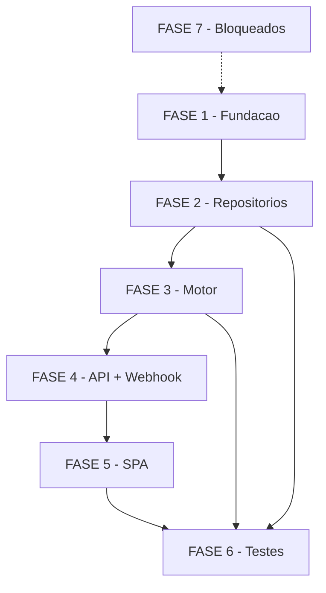

# Tarefas face-flow - Editor de Fluxo por Reconhecimento Facial

Escopo: Pipeline completo da feature face-flow — migrations, domínio Go, repositórios pgx,
motor de execução (9 tipos de nó, circuit-break, snapshot, interpolação de variáveis),
API REST admin, SPA admin (editor de canvas SVG) e testes. Inclui tasks de segurança
mandatórias dos checklists (SSRF, cifragem de segredos, mascaramento em log,
idempotência de side-effects, bound de concorrência). Tasks bloqueadas por contrato
externo isoladas na FASE 7.

Spec: `docs/specs/face-flow/spec.md`
Plan: `docs/specs/face-flow/plan.md`
Data model: `docs/specs/face-flow/data-model.md`

**Legenda de status:**
- `[ ]` Pendente
- `[~]` Em andamento
- `[x]` Concluido
- `[!]` Bloqueado

**Legenda de criticidade:**
- `[C]` Critico - Impacto financeiro direto ou bloqueante
- `[A]` Alto - Funcionalidade essencial
- `[M]` Medio - Necessario mas sem urgencia imediata

**Legenda de status especial:**
- `[BLOCKED_ISAPI]` Aguarda contrato ISAPI verificado do operador — nao implementavel
- `[BLOCKED_API]` Aguarda contrato de API externa verificado do operador — nao implementavel

---

## FASE 1 - Fundacao: Migrations e Dominio Go

> Pre-requisito de todas as fases. Sem tabelas e dominio nada compila.

### 1.1 Migration 000008_create_flows `[C]`

Ref: spec.md §Key Entities, data-model.md §Migration

- [x] 1.1.1 Criar `migrations/000008_create_flows.up.sql` com tabelas `flows` (BIGSERIAL, nome, status CHECK, device_id UNIQUE nullable FK), `background_images`, `flow_execution_logs` (event_key UNIQUE, status CHECK completed/circuit_break, failed_node_id nullable)
- [x] 1.1.2 Criar indices: `idx_flows_status`, `idx_flows_device_id WHERE NOT NULL`, `idx_flow_execution_logs_flow_id`, `idx_flow_execution_logs_device_id`, `idx_flow_execution_logs_started_at DESC`
- [x] 1.1.3 Criar `migrations/000008_create_flows.down.sql`: DROP TABLE flow_execution_logs, background_images, flows (nessa ordem, FK)
- [x] 1.1.4 Criar `migrations/000009_flows_sealed_config.up.sql`: adicionar coluna `sealed_config JSONB` em `flows` para armazenar segredos cifrados de headers de no HTTPS (dependencia de 3.8)
- [x] 1.1.5 Criar `migrations/000009_flows_sealed_config.down.sql`: DROP COLUMN sealed_config

### 1.2 Dominio `internal/flow` `[C]`

Ref: plan.md §2, data-model.md §Entidades Go

- [x] 1.2.1 Criar `internal/flow/flow.go`: `NodeType` (9 consts: start, camera_on, camera_off, wait, change_background, https_call, qrcode_background, decision, send_message), `FlowNode`, `FlowEdge`, `Flow`, configs tipadas (`WaitConfig`, `ChangeBackgroundConfig`, `HTTPSCallConfig`, `QRCodeBackgroundConfig`, `SendMessageConfig`); helpers `FindNodeByType`, `FindNodeByID`, `OutgoingEdges`, `NextNodeID`, `NextNodeIDByLabel`
- [x] 1.2.2 Criar `internal/flow/validator.go`: `Validate(*Flow) []ValidationError` com (1) exatamente-1-start (erros no_start_node/multiple_start_nodes), (2) decision exige 2 edges com labels "valid" e "invalid", (3) referencias dangling, (4) DFS white/gray/black para deteccao de ciclos; struct `ValidationError{Code, Message, NodeID}`
- [x] 1.2.3 Criar `internal/flow/interpolator.go`: `InterpolateVariables(template string, ctx ExecutionContext) string`; regexp `\[([a-z][a-z0-9._]*)\]`; vocabulario fechado de 10 variaveis (user.name, user.document, user.status, user.mobile, device.id, device.identifier, device.ip, device.mac, event.authorized, event.datetime); variavel ausente → ""; sintaxe invalida → preservar literal
- [x] 1.2.4 Criar `internal/flow/doc.go` com descricao do pacote

---

## FASE 2 - Repositorios pgx

> Implementacoes concretas em `internal/repository`. Dependem das tabelas da FASE 1.

### 2.1 FlowRepository pgx `[C]`

Ref: plan.md §4.1

- [x] 2.1.1 Criar interface `FlowRepository` em `internal/repository/flow_repository.go` (Create, FindByID, FindAll, FindActiveByDeviceID, Update, SetStatus, SetDeviceID, Delete)
- [x] 2.1.2 Implementar `PgxFlowRepository`: serializar nodes/edges via `json.Marshal`/`Unmarshal` para JSONB; `FindActiveByDeviceID`: SELECT WHERE device_id=$1 AND status='active'
- [x] 2.1.3 `SetDeviceID(ctx, flowID, deviceID *int64)`: nil → SET device_id=NULL; &id → UPDATE com constraint UNIQUE; retornar erro de negocio `409` na violacao pgx `23505`
- [x] 2.1.4 Registrar construtor `NewPgxFlowRepository(pool)` para injecao em main.go

### 2.2 BackgroundImageRepository pgx `[A]`

Ref: plan.md §4.2

- [x] 2.2.1 Criar interface `BackgroundImageRepository` em `internal/repository/background_image_repository.go` (Create, FindByID, FindAll, Delete)
- [x] 2.2.2 Implementar `PgxBackgroundImageRepository` com construtor `NewPgxBackgroundImageRepository(pool)`
- [x] 2.2.3 `Delete`: remover apenas registro do DB (handler HTTP remove arquivo em disco)

### 2.3 FlowExecutionLogRepository pgx `[C]`

Ref: plan.md §4.3, spec.md §CL-001

- [x] 2.3.1 Criar interface `FlowExecutionLogRepository` em `internal/repository/flow_execution_log_repository.go` (Create, FindByFlowID com limit/offset)
- [x] 2.3.2 Implementar `PgxFlowExecutionLogRepository`: `Create` idempotente — violacao UNIQUE em event_key (pgx code `23505`) → retornar nil (nao e erro de negocio; e idempotencia de execucoes concorrentes FR-023)
- [x] 2.3.3 `FindByFlowID`: SELECT WHERE flow_id=$1 ORDER BY started_at DESC LIMIT $2 OFFSET $3
- [x] 2.3.4 Registrar construtor `NewPgxFlowExecutionLogRepository(pool)`

---

## FASE 3 - Motor de Execucao (flowengine)

> Pacote `internal/flowengine`. Inclui tasks de seguranca mandatorias dos checklists.
> Dependem das FASES 1 e 2.

### 3.1 Engine core `[C]`

Ref: plan.md §3.1

- [x] 3.1.1 Criar `internal/flowengine/engine.go`: struct `Engine` com dependencias (hikClientFor, memberRepo, logRepo, bgImageRepo, flowRepo, httpClient); construtor `New(Config) *Engine`
- [x] 3.1.2 Implementar `TriggerForDevice(macAddress string, event, member, device)`: (1) buscar fluxo ativo por MAC, (2) se ausente retornar imediatamente (passthrough silencioso FR-019), (3) copiar snapshot, (4) disparar `go e.execute(snapshot, ...)`
- [x] 3.1.3 Implementar `execute(ctx, snapshot, event, member, device)`: validar snapshot via `flow.Validate()`; loop de nos iniciando em NodeTypeStart; despachar `executeNode` por tipo; chamar `nextNodeFor` para avanco; detectar fim de fluxo (nextID == "")
- [x] 3.1.4 Implementar `circuitBreak`: logar via `internal/logging` (campos device_id, flow_id, node_id, error_code sem body/CPF) + persistir FlowExecutionLog{status:"circuit_break"} — ignorar violacao UNIQUE (FR-023)
- [x] 3.1.5 Implementar `logCompleted`: persistir FlowExecutionLog{status:"completed"} — idem para UNIQUE
- [x] 3.1.6 Criar `internal/flowengine/doc.go`

### 3.2 No wait `[C]`

Ref: plan.md §3.2, spec.md §FR-012

- [x] 3.2.1 Criar `internal/flowengine/node_wait.go`: `executeWait(ctx, node)` com decode de `WaitConfig`; validar `duration_seconds` em [1, 3600] (retornar erro → circuit-break se fora)
- [x] 3.2.2 Implementar espera via `select { case <-time.After(...): return nil; case <-ctx.Done(): return ctx.Err() }` para cancelamento limpo

### 3.3 No https_call `[C]`

Ref: plan.md §3.3, spec.md §FR-014, security CHK001

- [x] 3.3.1 Criar `internal/flowengine/node_https.go`: `executeHTTPSCall(ctx, node, execCtx)` com decode de `HTTPSCallConfig`; interpolar body e headers via `flow.InterpolateVariables`
- [x] 3.3.2 Aplicar timeout por no: default 30s, cap 300s (CL-005); drenar body da resposta; aceitar qualquer HTTP status (FR-014)
- [x] 3.3.3 **[SEC-SSRF]** Antes de disparar: resolver hostname da URL; bloquear IPs RFC 1918 (10.x, 172.16-31.x, 192.168.x), link-local (169.254.x), loopback (127.x) e IPv6 (::1); retornar erro `"https_call: SSRF bloqueado: alvo em range proibido"` → circuit-break (security CHK001)

### 3.4 Nos background `[C]`

Ref: plan.md §3.4, spec.md §FR-013/FR-015

- [x] 3.4.1 Exportar `ResizeImageJPEG` em `internal/hikvision/client_bootpic.go` (renomear de minuscula para maiuscula; ajustar referencias internas ao pacote)
- [x] 3.4.2 Criar `internal/flowengine/node_background.go`: `executeChangeBackground(ctx, node, device)` — ler imagem de disco via `bgImageRepo.FindByID` + `os.ReadFile`, redimensionar 600x1024 JPEG, `UploadStandbyPicture`, `EnableCustomStandby`
- [x] 3.4.3 Implementar `executeQRCodeBackground(ctx, node, execCtx, device)` — gerar QR PNG via `github.com/skip2/go-qrcode`, interpolar content_template, redimensionar, upload via mesmo caminho do no 4

### 3.5 Nos bloqueados placeholder `[A]`

Ref: plan.md §3.5, spec.md §Dependencias

- [x] 3.5.1 Criar `internal/flowengine/node_blocked.go`: `executeBlocked(node) error` para camera_on, camera_off e send_message; retornar erro descritivo (BLOCKED_ISAPI / BLOCKED_API) que aciona circuit-break; nao executar nenhuma chamada externa

### 3.6 Bound de concorrencia e timeout global `[C]`

Ref: performance CHK005, CHK009; plan.md §3.1

- [x] 3.6.1 Adicionar semaforo (canal bufferizado) no Engine com capacidade configuravel (default 10) para limitar goroutines de execucao simultaneas; se semaforo cheio, descartar evento com log warning (nao bloquear o webhook)
- [x] 3.6.2 Aplicar `context.WithTimeout(ctx, 30*time.Minute)` no inicio de `execute`; circuit-break registra timeout global como status "circuit_break" com error "timeout global atingido"

### 3.7 Guarda de idempotencia de side-effects `[C]`

Ref: api CHK007, Constituicao §II

- [x] 3.7.1 No inicio de `execute`, antes de entrar no loop de nos, verificar se ja existe `FlowExecutionLog` com `event_key` E status `completed`; se sim, retornar imediatamente (skip silencioso) — resolve tensao FR-023 vs Constituicao §II
- [x] 3.7.2 Documentar no codigo a semantica: "at-least-once com deduplicacao por event_key; side-effects nao se repetem se execucao anterior concluiu com sucesso"

### 3.8 Cifragem de segredos na config de no `[C]`

Ref: security CHK005/CHK006, Constituicao §segredos

- [x] 3.8.1 Implementar mecanismo de campo selado: no PUT /flows/{id}, API reconhece headers com valor prefixado `"__secret__:valor"` → cifra com AES-256-GCM via `internal/secrets.Encrypt()` e persiste em `sealed_config` JSONB; campo `config` armazena a chave com `"__sealed__"` como valor-sentinela
- [x] 3.8.2 No GET /flows/{id}, mascarar valores selados: retornar `"__secret__:***"` em vez do valor real (CHK006)
- [x] 3.8.3 Em `executeHTTPSCall`, decifrar valores selados de headers via `internal/secrets.Decrypt()` antes de construir a requisicao; nunca logar o valor decifrado

### 3.9 Mascaramento em logs do motor `[C]`

Ref: security CHK007, Constituicao §logging, spec.md §FR-021

- [x] 3.9.1 Importar e usar `internal/logging` em todos os pontos de log do pacote `flowengine` (nao `slog` direto)
- [x] 3.9.2 Em `circuitBreak`: logar apenas `flow_id`, `device_id`, `node_id`, `error_code` — nunca o body interpolado nem headers de auth; aplicar `domain.MaskCPFForLog` no CPF antes de logar
- [x] 3.9.3 Em `executeHTTPSCall`: ao logar erro, usar apenas `error_code` sem URL com parametros nem body (pode conter CPF/token interpolado)

---

## FASE 4 - API HTTP e Integracao Webhook

> Camada HTTP em `internal/http`. Dependem das FASES 1, 2 e 3.

### 4.1 Handlers REST de fluxos `[C]`

Ref: plan.md §5

- [x] 4.1.1 Criar `internal/http/admin_flow_handlers.go` com 10 rotas: GET/POST /admin/api/flows; GET/PUT/DELETE /admin/api/flows/{id}; PUT /activate e /deactivate; PUT/DELETE /admin/api/flows/{id}/device; GET /admin/api/flows/{id}/logs
- [x] 4.1.2 PUT /flows/{id} e PUT /activate: chamar `flow.Validate()`; retornar 422 com JSON `{"errors": [{"code":"...","message":"...","node_id":"..."}]}` se invalido
- [x] 4.1.3 PUT /flows/{id}/device: verificar device existe; verificar 1:1 (retornar 409 com mensagem explicativa se device ja tem fluxo ativo)
- [x] 4.1.4 Criar test file `internal/http/admin_flow_handlers_test.go` com testes de handler (mock de repositorios)

### 4.2 Handlers de imagens de background `[A]`

Ref: plan.md §5

- [x] 4.2.1 Criar `internal/http/admin_background_images_handlers.go`: GET /admin/api/background-images, POST (multipart/form-data JPEG/PNG, reject >5MB, armazenar com uuid.ext), DELETE (remover arquivo + DB)
- [x] 4.2.2 Validar extensao MIME (JPEG/PNG apenas); rejeitar outros formatos com 415

### 4.3 Registro de rotas e wiring em main.go `[C]`

Ref: plan.md §5/§6

- [x] 4.3.1 Adicionar `adminFlowsRouter` e `adminBackgroundImagesRouter` em `internal/http/server.go` seguindo padrao de `adminDevicesRouter`; aplicar middlewares AdminAuth + Session
- [x] 4.3.2 Adicionar `BACKGROUND_IMAGES_DIR` em `internal/config` (default `./data/background-images`); criar diretorio se inexistente na inicializacao
- [x] 4.3.3 Instanciar em `cmd/presenca-facial/main.go`: flowRepo, bgImageRepo, logRepo, flowEngine (Config com hikClientFor, repos, BgImagesDir)
- [x] 4.3.4 Adicionar `github.com/skip2/go-qrcode` em `go.mod` e `go.sum` via `go get` (ja estava presente — adicionado na FASE 3)

### 4.4 Integracao no webhook handler `[C]`

Ref: plan.md §6, spec.md §FR-018/FR-019

- [x] 4.4.1 Em `internal/http/handlers.go`, apos processar attendance, adicionar: `if h.flowEngine != nil && payload.EventType == "AccessControllerEvent" { go h.flowEngine.TriggerForDevice(macAddress, savedEvent, resolvedMember, resolvedDevice) }`
- [x] 4.4.2 Campo `flowEngine` injetado no Server/Handler em `main.go` como nil-safe (feature desabilitada se nil); heartbeat e demais tipos de evento nao acionam o motor (FR-018)

---

## FASE 5 - SPA Admin (Frontend)

> Telas em `internal/web/dist` (vanilla JS, hash routing). Dependem da FASE 4.

### 5.1 Tela de listagem de fluxos `[A]`

Ref: plan.md §7, spec.md §FR-001/FR-006

- [x] 5.1.1 Adicionar rota `#/flows` no router hash da SPA; link no menu de navegacao existente
- [x] 5.1.2 Tabela com colunas: id, nome, status (badge ativo/inativo), dispositivo vinculado; acoes: editar (#/flows/{id}/edit), ativar/desativar, excluir
- [x] 5.1.3 Botao "Novo Fluxo": POST /admin/api/flows + redirecionar para editor

### 5.2 Editor de canvas SVG `[C]`

Ref: plan.md §7, spec.md §FR-002/FR-003

- [x] 5.2.1 Adicionar rota `#/flows/{id}/edit`; layout 3 colunas: paleta (tipos de no), canvas SVG (layer de arestas + layer de nos), painel de configuracao
- [x] 5.2.2 Paleta de nos: arrastar do palette para canvas via mousedown/mousemove/mouseup; nos BLOCKED (camera_on, camera_off, send_message) renderizados em cinza com icone de aviso "aguardando contrato"
- [x] 5.2.3 Nos no canvas: divs arrastaveis; porta(s) de saida clicareis para iniciar conexao; no decision com 2 portas rotuladas "valid" e "invalid"; botao de remover no
- [x] 5.2.4 Arestas como `<path>` bezier SVG entre portas; recalcular ao mover no; clicar na aresta + Delete remove a aresta; aresta de decision exibe label "valid"/"invalid"

### 5.3 Painel de configuracao por tipo de no `[C]`

Ref: plan.md §7, spec.md §FR-012/FR-014/FR-016/FR-020

- [x] 5.3.1 `start`, `decision`: sem campos no painel
- [x] 5.3.2 `wait`: campo numerico `duration_seconds` (1–3600); validacao client-side
- [x] 5.3.3 `change_background`: dropdown de imagens populado de GET /admin/api/background-images; link para upload de nova imagem
- [x] 5.3.4 `https_call`: campos url, method (select GET/POST/PUT/PATCH), lista de headers key-value (adicionar/remover par), body (textarea), timeout_seconds; valores de header com checkbox "secreto" (envia como `__secret__:valor`)
- [x] 5.3.5 `qrcode_background`: textarea `content_template` com hint do vocabulario de variaveis disponivel (user.name, user.document, etc.)
- [x] 5.3.6 `send_message`: textarea `message_template` + aviso "contrato de API pendente — BLOCKED_API"
- [x] 5.3.7 `camera_on`, `camera_off`: form de leitor facial com campo `verify_mode` opcional (placeholder mostra o default cardOrFace/card) — desbloqueado (ver §7.1/§7.2)

### 5.4 Botao Publicar e validacao inline `[C]`

Ref: plan.md §7, spec.md §FR-005/SC-006

- [x] 5.4.1 Botao "Salvar": PUT /admin/api/flows/{id} com nodes+edges atuais (sem ativar)
- [x] 5.4.2 Botao "Publicar (Ativar)": PUT /admin/api/flows/{id} + PUT /admin/api/flows/{id}/activate em sequencia
- [x] 5.4.3 Em caso de 422: exibir lista de ValidationError; quando node_id disponivel, destacar o no errado no canvas com borda vermelha; exibir painel de erros agregado

### 5.5 Upload de imagens de background `[A]`

Ref: plan.md §7, spec.md §FR-024

- [x] 5.5.1 Secao/modal acessivel no editor (botao "Gerenciar Imagens"); `<input type="file" accept="image/jpeg,image/png">`; POST para /admin/api/background-images multipart
- [x] 5.5.2 Listar imagens existentes com miniatura e botao remover (DELETE /admin/api/background-images/{id})

### 5.6 Tela de logs de execucao `[A]`

Ref: plan.md §7, spec.md §CL-001

- [x] 5.6.1 Adicionar rota `#/flows/{id}/logs`: tabela com started_at, finished_at, status (badge completed/circuit_break), device_id, failed_node_id, error
- [x] 5.6.2 Paginacao simples (Next/Prev); GET /admin/api/flows/{id}/logs?limit=20&offset=N

---

## FASE 6 - Testes

> Cobertura dos cenarios do plan §8. Dependem das FASES 1 a 5.

### 6.1 Testes unitarios internal/flow `[C]`

Ref: plan.md §8.1

- [x] 6.1.1 `TestValidate_NoStart`, `TestValidate_MultipleStart`: fluxo sem/com duplicado nó start
- [x] 6.1.2 `TestValidate_Cycle`: A→B→C→A detecta ciclo
- [x] 6.1.3 `TestValidate_DecisionMissingBranch`, `TestValidate_DecisionMissingLabel`: decision com 1 edge ou sem label "valid"/"invalid"
- [x] 6.1.4 `TestValidate_DanglingReference`, `TestValidate_ValidFlow`: edge para no inexistente; fluxo valido completo com bifurcacao
- [x] 6.1.5 `TestInterpolate_AllVars`, `TestInterpolate_MissingVar`, `TestInterpolate_UnknownVar`, `TestInterpolate_InvalidSyntax`

### 6.2 Testes unitarios internal/flowengine `[C]`

Ref: plan.md §8.2

- [x] 6.2.1 `TestEngine_NoFlow`: device sem fluxo → TriggerForDevice retorna sem executar
- [x] 6.2.2 `TestEngine_InvalidFlow`: fluxo com ciclo → circuit-break imediato no validate
- [x] 6.2.3 `TestEngine_WaitNode`: start→wait(1s)→end executa em ~1s
- [x] 6.2.4 `TestEngine_HTTPSCallTimeout`: servidor nao-responsivo + timeout 1s → circuit-break
- [x] 6.2.5 `TestEngine_DecisionValid`, `TestEngine_DecisionInvalid`: event.authorized true/false → ramo correto
- [x] 6.2.6 `TestEngine_BlockedNode_Camera`, `TestEngine_BlockedNode_Message`: circuit-break com mensagem BLOCKED_*
- [x] 6.2.7 `TestEngine_ConcurrentExecutions`: dois disparos simultaneos → 2 goroutines independentes sem interferencia de estado
- [x] 6.2.8 `TestEngine_SSRFBlocked`: URL apontando para 192.168.x.x → circuit-break (3.3.3)
- [x] 6.2.9 `TestEngine_IdempotencyGuard`: segundo evento com mesmo event_key apos completed → skip silencioso (3.7)

### 6.3 Testes de integracao repositorios `[A]`

Ref: plan.md §8.3; build tag `integration`; requer `make docker-up`

- [x] 6.3.1 `TestFlowRepository_CreateFind`, `TestFlowRepository_UniqueDeviceID`
- [x] 6.3.2 `TestFlowRepository_FindActiveByDeviceID`: ativo encontrado; inativo nao
- [x] 6.3.3 `TestFlowExecutionLog_IdempotentEventKey`: segundo insert com mesmo event_key → nil

### 6.4 Testes de integracao webhook `[A]`

Ref: plan.md §8.4; build tag `integration`; requer DB ativo

- [x] 6.4.1 `TestWebhook_AccessControllerEvent_TriggersEngine`: POST evento → flow engine disparado
- [x] 6.4.2 `TestWebhook_HeartbeatIgnoredByEngine`: heartbeat → engine NAO disparado
- [x] 6.4.3 `TestWebhook_NoFlowForDevice`: device sem fluxo → webhook 200 sem erro

---

## FASE 7 - Bloqueados: Aguardando Contrato Externo

> Atualizacao: o operador esclareceu que "camera" = LEITOR FACIAL e apontou o
> contrato no hik2go (face-enable/face-disable). Os nos 1/2 foram DESBLOQUEADOS
> e implementados (ver node_camera.go). Resta o no 8 (send_message), ainda sem
> contrato de API.

### 7.1 No camera_on — leitor facial ON `[M]` — CONCLUIDO

Ref: spec.md §FR-010 · SOURCED: legacy/hik2go/examples/1-device/face-enable.php

- [x] 7.1.1 Implementar `executeCameraOn` (internal/flowengine/node_camera.go): habilita o leitor facial via `SetVerifyMode` (verifyMode default `cardOrFace`, configuravel por no) + `PutIdentityTerminal` (showMode `normal`). Reusa operacoes ISAPI verificadas (client_authmode.go / client_display.go). verifyMode configuravel via `CameraConfig.verify_mode`.

### 7.2 No camera_off — leitor facial OFF `[M]` — CONCLUIDO

Ref: spec.md §FR-011 · SOURCED: legacy/hik2go/examples/1-device/face-disable.php

- [x] 7.2.1 Implementar `executeCameraOff`: desabilita o leitor facial via `SetVerifyMode` (default `card`, configuravel) + `PutIdentityTerminal` (showMode `full`/standby). Mesma reutilizacao de operacoes verificadas.

### 7.3 No send_message — implementacao API externa `[M]`

Ref: spec.md §FR-017, plan.md §BLOQUEIO B-002

- [!] 7.3.1 **[BLOCKED_API]** Implementar envio real via API externa; aguarda operador fornecer endpoint, metodo HTTP, headers (incl. auth), schema do payload e mapeamento do message_template — zero fabricacao (Constituicao §I)

---

## Matriz de Dependencias

**Dependencias criticas internas:**

| Task | Depende de |
|------|-----------|
| 2.1–2.3 | 1.1 (tabelas), 1.2 (entidades) |
| 3.1 | 2.1, 2.3, 1.2 (validator) |
| 3.3 | 1.2.3 (interpolator); 3.3.3 (SSRF) deve preceder execucao de HTTPS |
| 3.4 | 3.4.1 (export ResizeImageJPEG); 2.2 (bgImageRepo) |
| 3.7 | 2.3 (lookup event_key em FlowExecutionLogRepository) |
| 3.8 | 1.1.4 (migration sealed_config); `internal/secrets` (existente) |
| 4.1 | 2.1, 1.2.2 (Validate), 3.1 |
| 4.3 | 3.4.3 (go-qrcode em go.mod) |
| 4.4 | 3.1 (Engine.TriggerForDevice) |
| 5.2–5.4 | 4.1, 4.2 |
| 6.1 | 1.2.2, 1.2.3 |
| 6.2 | 3.1–3.5 |
| 6.3 | 2.1–2.3 + Postgres |
| 6.4 | 4.4 + DB |

---

## Resumo Quantitativo

| Fase | Tarefas | Subtarefas | Criticidade |
|------|---------|------------|-------------|
| 1 - Fundacao | 2 | 9 | C |
| 2 - Repositorios | 3 | 11 | C/A |
| 3 - Motor | 9 | 24 | C/A |
| 4 - API + Webhook | 4 | 13 | C/A |
| 5 - SPA | 6 | 19 | C/A |
| 6 - Testes | 4 | 17 | C/A |
| 7 - Bloqueados | 3 | 3 | M |
| **Total** | **31** | **96** | - |

Tasks `[C]` (Critico): 1.1, 1.2, 2.1, 2.3, 3.1, 3.2, 3.3, 3.4, 3.6, 3.7, 3.8, 3.9, 4.1, 4.3, 4.4, 5.2, 5.3, 5.4, 6.1, 6.2 — total 20.
Tasks de seguranca mandatorias (achados dos checklists): 3.3 (SSRF), 3.6 (bound), 3.7 (idempotencia), 3.8 (cifragem), 3.9 (log masking).
Tasks bloqueadas por contrato externo: 7.1, 7.2, 7.3.

---

## Escopo Coberto

| Item | Descricao | Fase |
|------|-----------|------|
| E01 | Migrations das 3 tabelas novas (flows, background_images, flow_execution_logs) + sealed_config | 1 |
| E02 | Dominio Go completo: NodeType (9 consts), FlowNode, FlowEdge, Flow, configs tipadas, helpers | 1 |
| E03 | Validador de fluxo: exatamente 1 start, DFS anti-ciclo, decision com 2 ramos, referencias dangling | 1 |
| E04 | Interpolador de variaveis: vocabulario fechado 10 vars, ausente→"", invalida→literal | 1 |
| E05 | Repositorios pgx para Flow, BackgroundImage e FlowExecutionLog (idempotencia event_key) | 2 |
| E06 | Motor de execucao: snapshot, loop de nos, circuit-break + reset, logCompleted | 3 |
| E07 | Nos implementaveis: start (9), wait (3), https_call (5), change_background (4), qrcode_background (6), decision (7) | 3 |
| E08 | Nos bloqueados como placeholder: camera_on (1), camera_off (2), send_message (8) — executeBlocked + aviso no editor | 3 |
| E09 | SSRF: bloqueio de IPs internos/link-local/loopback antes de chamada HTTPS | 3 |
| E10 | Bound de concorrencia: semaforo de goroutines + timeout global 30 min | 3 |
| E11 | Idempotencia de side-effects: skip se event_key ja completed (Constituicao §II) | 3 |
| E12 | Cifragem AES-256-GCM de headers sensiveis (sealed_config JSONB) | 3 |
| E13 | Mascaramento em logs: MaskCPFForLog, sem body/token nos logs do motor | 3 |
| E14 | API REST admin completa: 10 rotas de fluxo + 3 de imagens + validacao 422/409 | 4 |
| E15 | Integracao webhook: somente AccessControllerEvent aciona o motor | 4 |
| E16 | Wiring em main.go: flowEngine, repos, BACKGROUND_IMAGES_DIR, go-qrcode | 4 |
| E17 | SPA: listagem, editor canvas SVG, painel de configuracao por tipo, Publicar, upload, logs | 5 |
| E18 | Testes unitarios: validator, interpolador, engine (9 cenarios), SSRF, idempotencia | 6 |
| E19 | Testes de integracao: repositorios + webhook | 6 |

## Escopo Excluido

| Item | Descricao | Motivo |
|------|-----------|--------|
| X01 | Implementacao real de camera_on e camera_off (nos 1 e 2) | BLOCKED_ISAPI: sem contrato verificado (B-001) |
| X02 | Implementacao real de send_message (no 8) | BLOCKED_API: sem contrato verificado (B-002) |
| X03 | Acessibilidade (a11y) do canvas do editor | Painel admin interno; escopo MVP nao cobre a11y (ux CHK005) |
| X04 | Controle de edicao concorrente entre dois admins | Fora de escopo MVP (ux CHK006) |
| X05 | Undo/redo no editor de canvas | Fora de escopo MVP |
| X06 | Retry/backoff na chamada do no HTTPS | Fire-and-forget intencional (api CHK004) |
| X07 | Alvo de throughput / limite de reconhecimentos por segundo | MVP cobre latencia de inicio e 2 concorrentes (perf CHK006) |
| X08 | Restricao de PII no conteudo do QR code (no 6) | Decisao do dono do produto / compliance (security CHK002/CHK013) |
| X09 | Key rotation dos segredos de no cifrados | Fora do escopo da feature inicial |
| X10 | Mascaramento de GET /flows/{id} para nao retornar sealed_config (CHK006 parcial) | Coberto por 3.8.2 (retorna `__secret__:***`); API externa de auditoria fora do escopo |
