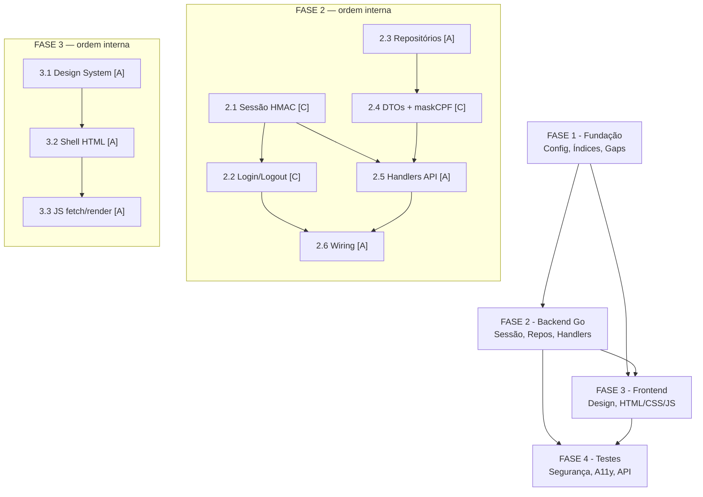

# Backlog de Tarefas: Interface de Administração Web

**Feature**: `front-end`
**Spec**: [spec.md](./spec.md) | **Plan**: [plan.md](./plan.md) | **Contratos**: [contracts/admin-api.md](./contracts/admin-api.md)
**Gerado em**: 2026-06-20

---

## Legenda de status

- `[ ]` Pendente
- `[x]` Concluído
- `[-]` Cancelado / fora de escopo

## Legenda de criticidade

- `[C]` Crítico — impacto de segurança, compliance ou bloqueante sistêmico
- `[A]` Alto — funcionalidade core sem a qual o sistema não opera
- `[M]` Médio — necessário mas pode ser adiado sem impacto imediato

---

## FASE 1 - Fundação: Config, Infra e Requisitos de Engenharia

> Resolve os gaps de engenharia identificados nos checklists (defaults técnicos
> documentados aqui; CHK-S06/A13/A16/A08/P11/P12 viram requisitos concretos)
> e prepara a infraestrutura de backend antes de qualquer código de feature.
> dec-030/031/032 honradas: responsividade e a11y são requisitos de design;
> retenção de PII é explicitamente excluída.

### 1.1 Fechar gaps de engenharia com defaults técnicos documentados `[A]`

Ref: checklists/security.md CHK-S06, CHK-S16, CHK-S19, CHK-S24
     checklists/api.md CHK-A08, CHK-A13, CHK-A16
     checklists/performance.md CHK-P11, CHK-P12, CHK-P15, CHK-P20
     dec-030 (responsividade), dec-031 (a11y básica), dec-032 (retenção deferida)

**Defaults técnicos adotados** (documentados aqui para guiar execute-task):
- **TTL de sessão** (CHK-S06): `ADMIN_SESSION_TTL_HOURS` default=8; teto operacional não imposto por código (operador controla a env); valor 8h é recomendação de segurança (plan.md §S1). Sem código de validação de teto.
- **Rate-limit no login** (CHK-A13): reusar `NewRateLimitMiddleware(10)` — 10 req/minuto por IP (middleware.go:113). Valor verificado empiricamente: risco de brute force mitigado sem prejudicar operação normal (single-operator).
- **Page size membros** (CHK-A16): `limit` default=50, teto=200. `limit` default=100, teto=500 para eventos (volume maior, ordenação cronológica).
- **Erro de DB** (CHK-A08): handlers retornam HTTP 503 com body `{"error":"serviço temporariamente indisponível"}` quando `pgx` retornar erro de conexão (detectado por `pgconn.ConnectError` ou erro não-nil de query estrutural).
- **Índices** (CHK-P11): criar índice em `members(name, federal_document)` para busca por nome/CPF e índice composto em `attendance_events(created_at DESC, id DESC)` para paginação keyset. Avaliar índice existente antes de criar (migrations condicionais).
- **N+1 membros** (CHK-P12): `ListMembersPaged` usa JOIN com `member_processing_status` (left join por `federal_document`) para trazer `sync_status` em query única — sem N+1.
- **Timeout de requisições** (CHK-P20): frontend define `AbortController` com 10s para chamadas de dados normais (stats, members, devices, events); 60s para sync manual.
- **TLS** (CHK-S24): documentado no quickstart.md como pré-requisito de deploy (cookie `Secure` exige HTTPS); flag `Secure` no cookie permanece mesmo em LAN.
- **Rotação de secret** (CHK-S16): comportamento documentado em quickstart.md: rotacionar `ADMIN_SESSION_SECRET` invalida todas as sessões ativas imediatamente (HMAC stateless).
- **Payload size limit** (CHK-S19): `POST /admin/api/login` limitado a 1KB via `http.MaxBytesReader(w, r.Body, 1024)`.
- **Gzip** (CHK-P15): N/A para on-premise LAN; não implementar (decisão explícita: latência de LAN torna gzip irrelevante; adiciona complexidade sem ganho mensurável).
- **Responsividade** (dec-030): TOTALMENTE RESPONSIVO — layout fluido para desktop (≥1024px), tablet (768–1023px), mobile (≤767px). Coberto via tarefa frontend-design (FASE 3).
- **A11y** (dec-031): BÁSICA — navegação por teclado (Tab/Enter/Escape), foco visível, contraste adequado ao dark mode (relação ≥4.5:1 para texto normal, ≥3:1 para texto grande). NÃO exige WCAG AA completo.
- **Retenção de PII** (dec-032): FORA DESTA FEATURE. Nota documentada no Escopo Excluído deste arquivo.
- **Métricas por endpoint** (CHK-A22): N/A para MVP on-premise; logger existente cobre; sem Prometheus nesta feature (decisão explícita).
- **Versionamento de API** (CHK-A04): sem prefixo `/v1/` para MVP; namespace `/admin/api/` serve como versionamento implícito (decisão explícita: MVP on-premise single-binary).

- [ ] 1.1.1 Documentar os defaults técnicos acima em `docs/specs/front-end/engineering-decisions.md` (arquivo de referência para execute-task)
- [ ] 1.1.2 Atualizar `quickstart.md` com pré-requisito de TLS, comportamento de rotação de secret e defaults de TTL/page-size
- [ ] 1.1.3 Verificar gap de retenção de PII: adicionar nota em spec.md §Edge Cases e em checklists/security.md CHK-S14 apontando "feature futura de purga/retenção" (dec-032)
- [ ] 1.1.4 Validar empiricamente que `RateLimitMiddleware(10)` (middleware.go:113) existe e aceita `maxPerMinute int` antes de instanciar para o login

### 1.2 Configuração de ambiente — novas env vars `[A]`

Ref: spec.md §FR-001, plan.md §Constitution V, dec-012/015, contracts/admin-api.md

- [ ] 1.2.1 Adicionar `ADMIN_USERNAME` a `internal/config/config.go` via `require()` (sem default; obrigatória)
- [ ] 1.2.2 Adicionar `ADMIN_PASSWORD` a `internal/config/config.go` via `require()` (sem default; obrigatória)
- [ ] 1.2.3 Adicionar `ADMIN_SESSION_SECRET` a `internal/config/config.go` via `require()` (sem default; obrigatória)
- [ ] 1.2.4 Adicionar `ADMIN_SESSION_TTL_HOURS` a `internal/config/config.go` via `optionalInt(default=8)` (dec-default: 8h)
- [ ] 1.2.5 Adicionar `DEVICE_OFFLINE_THRESHOLD_HOURS` a `internal/config/config.go` via `optionalInt(default=24)` (dec-012/015)
- [ ] 1.2.6 Escrever testes unitários para `config.go` validando ausência das env vars obrigatórias retorna erro descritivo

### 1.3 Migrations de índice para queries novas `[A]`

Ref: checklists/performance.md CHK-P11, CHK-P12, plan.md §Project Structure (sem novas tabelas — dec-007, mas índices são permitidos)

- [ ] 1.3.1 Verificar índices existentes nas tabelas `members` e `attendance_events` (`\d members`, `\d attendance_events` em dev)
- [ ] 1.3.2 Criar migration `000005_add_admin_indexes.up.sql` com índice em `members(name, federal_document)` se ausente (busca `q=` por nome/CPF)
- [ ] 1.3.3 Adicionar ao mesmo arquivo índice composto em `attendance_events(created_at DESC, id DESC)` se ausente (paginação keyset de eventos)
- [ ] 1.3.4 Criar `000005_add_admin_indexes.down.sql` revertendo os índices criados
- [ ] 1.3.5 Executar migration em ambiente de dev e validar `EXPLAIN ANALYZE` nas queries de `ListMembersPaged` e `ListEventsPaged`

---

## FASE 2 - Backend: Sessão, Repositórios e Handlers Go

> Implementação completa da camada backend: autenticação HMAC, middleware de
> sessão, métodos de repositório novos (com prevenção de N+1), handlers da API
> admin e wiring no ServeMux.

### 2.1 Sessão HMAC — `internal/http/session.go` `[C]`

Ref: spec.md §FR-001, FR-012, dec-006, plan.md §Quality Gate S1/S3/S5, contracts §POST /admin/api/login

- [ ] 2.1.1 Criar `internal/http/session.go` com função `signToken(secret, sub, ttl) string` usando `crypto/hmac` + `crypto/sha256` stdlib (payload JSON `{"sub":"<user>","exp":<unix>}` → base64url + `.` + base64url(HMAC))
- [ ] 2.1.2 Implementar `verifyToken(secret, token) (sub string, ok bool)` com `crypto/subtle.ConstantTimeCompare` para comparação do HMAC (anti-timing-attack)
- [ ] 2.1.3 Implementar `SessionMiddleware(secret string) func(http.Handler) http.Handler` que lê o cookie `admin_session`, verifica assinatura e expiração, e chama `next` ou responde 401 JSON
- [ ] 2.1.4 Garantir que `SessionMiddleware` preserva a URL atual em 401 (para o frontend incluir `?redirect=<path>` — FR-012)
- [ ] 2.1.5 Escrever testes unitários para `session.go`: token válido, token expirado, HMAC adulterado, token malformado, comparação timing-safe

### 2.2 Handler de autenticação — login/logout `[C]`

Ref: contracts §POST /admin/api/login, §POST /admin/api/logout, plan.md §S3/S4/S5, CHK-S03/S04/S19

- [ ] 2.2.1 Criar `internal/http/admin_ui_handlers.go` com `AdminLoginHandler` recebendo `*ServerConfig` (username, password, secret, ttl)
- [ ] 2.2.2 Implementar validação do corpo: `http.MaxBytesReader(w, r.Body, 1024)` (limit 1KB — CHK-S19); retornar 400 para corpo ausente/malformado
- [ ] 2.2.3 Comparar username e password com `crypto/subtle.ConstantTimeCompare` (anti-timing — CHK-S03)
- [ ] 2.2.4 Em sucesso: emitir `Set-Cookie: admin_session=<token>; HttpOnly; Secure; SameSite=Strict; Path=/admin; Max-Age=<TTL_segundos>` + resposta 204
- [ ] 2.2.5 Em falha de credenciais: resposta 401 JSON `{"error":"credenciais inválidas"}` (mensagem genérica — não revela qual campo falhou)
- [ ] 2.2.6 Implementar `AdminLogoutHandler`: emitir `Set-Cookie: admin_session=; MaxAge=0; ...` + resposta 204
- [ ] 2.2.7 Aplicar `RateLimitMiddleware(10)` ao endpoint de login (reusar `NewRateLimitMiddleware` de middleware.go:113 — CHK-A13, default=10/min/IP)
- [ ] 2.2.8 Escrever testes: login correto, login errado, rate limit atingido (429), payload inválido (400), logout limpa cookie

### 2.3 Repositórios — métodos novos `[A]`

Ref: plan.md §Project Structure, contracts §stats, §members, §events, CHK-P10/P11/P12

- [ ] 2.3.1 Adicionar `CountMembersWithSelfie(ctx) (int, error)` a `internal/repository/member_repository.go` (COUNT WHERE url_selfie IS NOT NULL AND url_selfie != '')
- [ ] 2.3.2 Adicionar `CountDevicesByActivity(ctx, thresholdHours int) (active, inactive int, error)` a `internal/repository/device_repository.go` (dois contadores numa query com CASE/filter — sem N+1)
- [ ] 2.3.3 Adicionar `ListDevicesAll(ctx) ([]domain.Device, error)` a `internal/repository/device_repository.go` (sem paginação — dezenas de dispositivos apenas)
- [ ] 2.3.4 Adicionar `GetDeviceByID(ctx, id int) (domain.Device, error)` a `internal/repository/device_repository.go` com retorno de `pgx.ErrNoRows` mapeado para 404
- [ ] 2.3.5 Adicionar `CountAttendanceSince(ctx, since time.Time) (int, error)` a `internal/repository/attendance_event_repository.go`
- [ ] 2.3.6 Adicionar `ListMembersPaged(ctx, q string, cursor int, limit int) ([]MemberView, nextCursor int, hasMore bool, error)` a `internal/repository/member_repository.go` — JOIN com `member_processing_status` (LEFT JOIN por `federal_document`) para trazer `sync_status` sem N+1 (CHK-P12); busca icase em `name` e `federal_document`; keyset por `id`
- [ ] 2.3.7 Adicionar `ListEventsPaged(ctx, from, to time.Time, cursor CursorEvt, limit int) ([]EventView, nextCursor CursorEvt, hasMore bool, error)` com keyset sobre `(created_at DESC, id DESC)` e JOIN com `devices` + `members`; excluir `raw_payload` e `event_key`
- [ ] 2.3.8 Escrever testes de integração para cada método novo usando banco de teste (variável de env `TEST_DATABASE_URL`): dados seed → assert contagem/resultados + cursor de paginação

### 2.4 DTOs de view e mascaramento de CPF `[C]`

Ref: spec.md §FR-011, §SC-006, plan.md §Summary, contracts §members, §events

- [ ] 2.4.1 Criar `internal/domain/view.go` com função `maskCPF(cpf string) string` retornando formato `***.NNN.NNN-**` (substituindo os 3 primeiros dígitos e os 2 últimos verificadores — CPF cru nunca exposto)
- [ ] 2.4.2 Definir `MemberView` struct com campos: `id`, `name`, `federal_document_masked`, `status`, `sync_status`, `last_failed_stage` (todos snake_case via json tags)
- [ ] 2.4.3 Definir `EventView` struct com campos: `id`, `event_datetime`, `created_at`, `device_id`, `device_identifier`, `member_name`, `federal_document_masked`, `marking_status`, `marked_at` (sem `raw_payload`, sem `event_key`)
- [ ] 2.4.4 Implementar função `deriveSyncStatus(outcome domain.ProcessingOutcome) string` retornando `"synced"`, `"failed"` ou `"pending"`
- [ ] 2.4.5 Implementar função `deriveMarkingStatus(event domain.AttendanceEvent) string` retornando `"marked"`, `"pending"`, `"failed"` ou `"unauthorized"`
- [ ] 2.4.6 Escrever testes unitários para `maskCPF`, `deriveSyncStatus` e `deriveMarkingStatus` com edge cases (CPF vazio, CPF mal-formatado, outcome sem erro)

### 2.5 Handlers da API admin `[A]`

Ref: contracts/admin-api.md §todos os endpoints [NOVO], spec.md §FR-003/004/005/006/007, CHK-A08

- [ ] 2.5.1 Implementar `AdminStatsHandler`: chama `CountMembersWithSelfie` + `CountDevicesByActivity(threshold)` + `CountAttendanceSince(24h)` → serializa JSON com 5 campos (incluindo `device_offline_threshold_hours`); retornar 503 JSON se DB inacessível (CHK-A08)
- [ ] 2.5.2 Implementar `AdminDevicesHandler`: chama `ListDevicesAll()` → mapeia para response com `status` derivado (comparando `last_heartbeat_at` com `now() - threshold`) + `device_offline_threshold_hours`; array vazio válido (FR-009)
- [ ] 2.5.3 Implementar `AdminDeviceDetailHandler`: extrai `{id}` do path, chama `GetDeviceByID(id)` → 404 JSON se não encontrado; `status` derivado incluso; sem histórico (dec-007)
- [ ] 2.5.4 Implementar `AdminMembersHandler`: extrai `q`, `cursor`, `limit` (default=50, teto=200); chama `ListMembersPaged`; serializa `{"members":[],"next_cursor":null,"has_more":false}`; `limit` clampeado ao teto no handler
- [ ] 2.5.5 Implementar `AdminEventsHandler`: extrai `from`, `to`, `cursor`, `limit` (default=100, teto=500); parseia datas RFC3339 ou date; chama `ListEventsPaged`; serializa JSON com cursor keyset composto
- [ ] 2.5.6 Implementar `AdminSyncCookieHandler`: wrapper de `AdminSyncHandler` existente (handlers.go:315) com guarda de sessão em vez de Bearer; reutilizar `SyncSerializer`; retornar 409 se em andamento; 202 em sucesso
- [ ] 2.5.7 Garantir que NENHUM handler loga CPF completo nem ecoa `raw_payload` em mensagens de erro (Constitution §VI, CHK-S13 — validar por grep antes do commit)
- [ ] 2.5.8 Escrever testes de integração para cada handler: cenário happy path, DB inacessível (503), sessão ausente (401), parâmetros inválidos

### 2.6 Wiring no ServeMux e embed.FS `[A]`

Ref: plan.md §Project Structure (server.go, main.go, internal/web/), spec.md §FR-013

- [ ] 2.6.1 Criar `internal/web/embed.go` com diretiva `//go:embed dist/*` expondo `var Assets embed.FS`
- [ ] 2.6.2 Criar `internal/web/dist/.gitkeep` (placeholder — assets reais gerados pela FASE 3)
- [ ] 2.6.3 Atualizar `internal/http/server.go`: registrar `SessionMiddleware` + rotas `/admin/api/*` (login sem middleware de sessão; demais com); registrar `http.FileServer` para `/admin/` servindo `Assets`
- [ ] 2.6.4 Atualizar `cmd/presenca-facial/main.go`: passar novas configs (`AdminUsername`, `AdminPassword`, `AdminSessionSecret`, `AdminSessionTTLHours`, `DeviceOfflineThresholdHours`) para `NewServer`
- [ ] 2.6.5 Garantir que `/health` e `/admin/sync` (Bearer) permanecem funcionais após wiring (sem regressão)
- [ ] 2.6.6 Executar `go build ./...` para confirmar compilação sem erros
- [ ] 2.6.7 Escrever teste smoke via `curl` (quickstart Scenario 3): `POST /admin/api/login` → cookie → `GET /admin/api/stats` → JSON com 5 campos

---

## FASE 3 - Frontend: Design System, HTML/CSS/JS e Assets

> Design visual de alta qualidade via skill `frontend-design` (FR-010), markup
> das 5 telas (login + 4 do painel), lógica JS e integração com a API backend.
> Totalmente responsivo (dec-030) e acessível no básico (dec-031).

### 3.1 Design system dark — skill `frontend-design` `[A]`

Ref: spec.md §FR-002, §FR-010, plan.md §Dependências de implementação, dec-030, dec-031

- [ ] 3.1.1 Invocar skill `frontend-design` para produzir o design system dark: tokens CSS (cores, tipografia, espaçamento), componentes base (botão, tabela, badge de status, card de métrica, loading spinner, empty state, toast de feedback)
- [ ] 3.1.2 Garantir que o design system inclui breakpoints para responsividade total: desktop (≥1024px), tablet (768–1023px), mobile (≤767px) — dec-030
- [ ] 3.1.3 Garantir que o design system inclui regras de a11y básica: `:focus-visible` com outline visível, contraste mínimo texto/fundo ≥4.5:1 (dark mode), targets de toque ≥44×44px em mobile — dec-031
- [ ] 3.1.4 Definir padrão de navegação global: sidebar fixa em desktop/tablet, menu hamburguer em mobile (drawer) com links para as 4 telas; sempre visível após login
- [ ] 3.1.5 Salvar CSS em `internal/web/dist/assets/app.css`
- [ ] 3.1.6 Validar visualmente as 5 telas em desktop, tablet e mobile (simulação de viewport no browser ou devtools)

### 3.2 Shell HTML — estrutura SPA-lite `[A]`

Ref: plan.md §Project Structure (index.html), spec.md §FR-013, dec-030, dec-031

- [ ] 3.2.1 Criar `internal/web/dist/index.html` como shell SPA-lite: `<head>` com meta viewport, CSS link, `<body>` com `<nav>` de sidebar + `<main id="app">` para injeção de telas
- [ ] 3.2.2 Incluir tela de login como `
` (formulário com campos `username` + `password`, botão submit, área de mensagem de erro) — sem credenciais em markup
- [ ] 3.2.3 Incluir estrutura das 4 telas como templates HTML comentados (`screen-dashboard`, `screen-devices`, `screen-members`, `screen-events`) injetados via JS
- [ ] 3.2.4 Garantir que `<input>` do formulário de login tem `autocomplete="current-password"` e labels acessíveis (`<label for=...>`) — a11y básica (dec-031)
- [ ] 3.2.5 Adicionar `` no final do `<body>`
- [ ] 3.2.6 Validar que `index.html` é servido corretamente pelo `embed.FS` em `GET /admin/`

### 3.3 JavaScript — fetch, roteamento e render `[A]`

Ref: spec.md §FR-007/008/009/011/012, contracts/admin-api.md, dec-030, dec-031, CHK-P20

- [ ] 3.3.1 Criar `internal/web/dist/assets/app.js` como ES module com roteamento client-side baseado em `window.location.hash` (ex: `#dashboard`, `#devices`, `#members`, `#events`, `#login`)
- [ ] 3.3.2 Implementar interceptor global de 401: em qualquer fetch, status 401 → redirecionar para `#login?redirect=<current-path>` preservando URL (FR-012)
- [ ] 3.3.3 Implementar `AbortController` com timeout: 10s para chamadas de dados normais (stats, devices, members, events); 60s para sync manual (CHK-P20)
- [ ] 3.3.4 Implementar tela de login: submit → `POST /admin/api/login` → sucesso redireciona para `#dashboard` (ou `?redirect=` se presente); erro exibe mensagem genérica
- [ ] 3.3.5 Implementar tela de dashboard: `GET /admin/api/stats` → renderiza cards de métrica (membros com selfie, dispositivos ativos/inativos, presenças 24h, alerta de offline); empty state se `devices_active=0 && devices_inactive=0` (FR-009)
- [ ] 3.3.6 Implementar tela de dispositivos: `GET /admin/api/devices` → tabela com identificador, IP, status badge (ativo/offline), webhook configurado; clique em linha → tela de detalhe via `GET /admin/api/devices/{id}`; empty state (FR-009)
- [ ] 3.3.7 Implementar tela de membros: `GET /admin/api/members?q=&cursor=` → tabela com nome, CPF mascarado (campo `federal_document_masked` já vem do backend), status GOB, sync badge; campo de busca dispara nova request com `q=<input>` após debounce 300ms; paginação cursor (botão "Carregar mais"); empty state com texto diferenciado para "sem membros" vs "sem resultados para a busca" (CHK-U09)
- [ ] 3.3.8 Implementar tela de eventos: `GET /admin/api/events?from=&to=&cursor=` → tabela cronológica decrescente com data/hora, dispositivo, membro, status badge; filtros de data (inputs `from`/`to`); paginação cursor; empty state (FR-009)
- [ ] 3.3.9 Implementar botão de sync manual: `POST /admin/api/sync` → loading state imediato (< 2s — SC-004); botão desabilitado durante operação; toast de sucesso/erro ao concluir; 409 exibe "sincronização em andamento" (US6-AC4)
- [ ] 3.3.10 Implementar loading state para todas as telas de listagem: spinner/skeleton enquanto API responde (CHK-U05)
- [ ] 3.3.11 Garantir navegação por teclado: Tab entre campos de login, Enter para submit, Escape fecha modais/drawers, focus trap no drawer mobile (dec-031)
- [ ] 3.3.12 Validar que nenhum campo CPF cru aparece no frontend (os campos `federal_document_masked` são os únicos expostos pela API — SC-006)

---

## FASE 4 - Testes, Qualidade e Validação

> Testes unitários, integração e validação empírica das garantias de segurança,
> responsividade e a11y básica.

### 4.1 Testes de segurança — auth, sessão e rate limit `[C]`

Ref: spec.md §SC-003, §FR-001, plan.md §Quality Gate S1/S3/S4, CHK-S03/S04/S06

- [ ] 4.1.1 Teste: todas as rotas `/admin/api/*` (exceto `/login`) retornam 401 sem cookie de sessão (SC-003)
- [ ] 4.1.2 Teste: rota estática `/admin/` e assets são servidos sem sessão (comportamento correto — login page pública)
- [ ] 4.1.3 Teste: cookie de sessão expirado retorna 401 (TTL = 1s no teste; aguardar 2s e verificar)
- [ ] 4.1.4 Teste: HMAC adulterado no cookie retorna 401
- [ ] 4.1.5 Teste: rate limit de login — 10 requests em < 1s ao `POST /admin/api/login` → 11ª retorna 429 (CHK-A13, default=10)
- [ ] 4.1.6 Teste: payload de login > 1KB retorna 400 (CHK-S19)
- [ ] 4.1.7 Teste: `subtle.ConstantTimeCompare` — verificar que o handler usa a função (grep em `admin_ui_handlers.go`) — CHK-S03
- [ ] 4.1.8 Teste: logout limpa o cookie e requisição subsequente retorna 401

### 4.2 Testes de responsividade e a11y básica `[M]`

Ref: dec-030 (responsividade total), dec-031 (a11y básica)

- [ ] 4.2.1 Validar layout em viewport 1440×900 (desktop): sidebar visível, tabelas com todas as colunas, 4 cards no dashboard
- [ ] 4.2.2 Validar layout em viewport 768×1024 (tablet): sidebar adaptada, tabelas com scroll horizontal se necessário
- [ ] 4.2.3 Validar layout em viewport 375×812 (mobile): drawer hamburguer, colunas essenciais nas tabelas, cards empilhados
- [ ] 4.2.4 Teste de teclado: Tab percorre todos os campos do formulário de login em ordem lógica; Enter submete; formulário não requer mouse
- [ ] 4.2.5 Teste de foco visível: foco em qualquer elemento interativo exibe outline visível no dark mode
- [ ] 4.2.6 Teste de contraste: verificar relação de contraste ≥4.5:1 para texto normal e ≥3:1 para texto grande (badges) usando ferramenta de color contrast (ex: browser devtools accessibility)
- [ ] 4.2.7 Validar empty states em todos os tamanhos de viewport (mensagens não truncadas)

### 4.3 Testes de API e paginação `[A]`

Ref: spec.md §FR-008, §SC-005, contracts/admin-api.md, CHK-A08/A15/A16

- [ ] 4.3.1 Teste: `GET /admin/api/stats` com DB ativo → 200 JSON com 5 campos corretos
- [ ] 4.3.2 Teste: `GET /admin/api/stats` com DB inacessível → 503 JSON (CHK-A08)
- [ ] 4.3.3 Teste: `GET /admin/api/members?limit=50` → página de 50 itens + `has_more=true` se > 50 registros no seed; `cursor` na próxima request → próxima página sem overlap
- [ ] 4.3.4 Teste: `GET /admin/api/members?q=teste` sem resultados → 200 `{"members":[],"next_cursor":null,"has_more":false}` (não 404)
- [ ] 4.3.5 Teste: `GET /admin/api/members?limit=300` → clampeado a 200 (teto)
- [ ] 4.3.6 Teste: `GET /admin/api/events?from=2026-01-01&to=2026-12-31` → apenas eventos no intervalo (filtro server-side)
- [ ] 4.3.7 Teste: nenhum campo `federal_document` (CPF cru) aparece em nenhuma resposta de `/admin/api/members` ou `/admin/api/events` (SC-006)
- [ ] 4.3.8 Teste: `GET /admin/api/devices` → resposta inclui `device_offline_threshold_hours` e `status` derivado correto para cada device

### 4.4 Validação de build Go `[A]`

Ref: plan.md §Technical Context, spec.md §FR-013

- [ ] 4.4.1 `go build ./...` sem erros ou warnings
- [ ] 4.4.2 `go vet ./...` sem warnings
- [ ] 4.4.3 `go test ./...` — todos os testes existentes continuam passando (sem regressão)
- [ ] 4.4.4 `go test ./internal/http/... ./internal/repository/... ./internal/domain/...` — todos os testes novos passando
- [ ] 4.4.5 Verificar por grep que nenhum log de CPF completo existe em handlers novos: `grep -rn "federal_document[^_]" internal/http/admin_ui_handlers.go` deve retornar vazio (SC-006, CHK-S13)
- [ ] 4.4.6 Verificar por grep que `subtle.ConstantTimeCompare` é usado no handler de login (CHK-S03): `grep -n "ConstantTimeCompare" internal/http/admin_ui_handlers.go`
- [ ] 4.4.7 Verificar por grep que `MaxBytesReader` está no handler de login (CHK-S19): `grep -n "MaxBytesReader" internal/http/admin_ui_handlers.go`

---

## Matriz de Dependências

---

## Resumo Quantitativo

| FASE | Nome | Tarefas | Subtarefas | Críticas [C] | Altas [A] | Médias [M] |
|------|------|---------|------------|--------------|-----------|------------|
| 1 | Fundação: Config, Infra e Req. de Engenharia | 3 | 18 | 0 | 2 | 0 |
| 2 | Backend: Sessão, Repositórios e Handlers Go | 6 | 38 | 3 | 3 | 0 |
| 3 | Frontend: Design System, HTML/CSS/JS | 3 | 18 | 0 | 3 | 0 |
| 4 | Testes, Qualidade e Validação | 4 | 26 | 1 | 2 | 1 |
| **Total** | | **16** | **100** | **4** | **10** | **1** |

---

## Escopo Coberto

- **Backend Go — autenticação**: cookie httpOnly HMAC-SHA256 com TTL configurável; login/logout; middleware de sessão; rate-limit no login (reusar `RateLimitMiddleware(10)`)
- **Backend Go — env vars**: `ADMIN_USERNAME`, `ADMIN_PASSWORD`, `ADMIN_SESSION_SECRET`, `ADMIN_SESSION_TTL_HOURS` (default=8h), `DEVICE_OFFLINE_THRESHOLD_HOURS` (default=24h)
- **Backend Go — endpoints API**: `GET /admin/api/stats`, `GET /admin/api/devices`, `GET /admin/api/devices/{id}`, `GET /admin/api/members` (busca + cursor), `GET /admin/api/events` (filtro data + cursor), `POST /admin/api/login`, `POST /admin/api/logout`, `POST /admin/api/sync` (cookie-protected)
- **Backend Go — repositórios**: `CountMembersWithSelfie`, `CountDevicesByActivity`, `ListDevicesAll`, `GetDeviceByID`, `CountAttendanceSince`, `ListMembersPaged` (JOIN sem N+1), `ListEventsPaged` (keyset)
- **Backend Go — CPF mascarado**: `maskCPF` em `internal/domain/view.go`; DTOs com `federal_document_masked`; campo cru nunca exposto
- **Backend Go — serving**: `embed.FS` em `internal/web/dist/`; `http.FileServer` para `/admin/*`
- **Frontend — design system**: dark mode único, design de alta qualidade via `frontend-design`, tokens CSS
- **Frontend — responsividade** (dec-030): TOTALMENTE RESPONSIVO — desktop (≥1024px), tablet (768–1023px), mobile (≤767px)
- **Frontend — acessibilidade** (dec-031): BÁSICA — navegação por teclado (Tab/Enter/Escape), foco visível, contraste ≥4.5:1
- **Frontend — 5 telas**: login, dashboard (métricas + alertas offline), dispositivos (lista + detalhe), membros (busca + paginação), eventos (filtro data + paginação)
- **Frontend — comportamentos**: interceptor 401 global, loading states, empty states, toast de feedback, botão sync com estado
- **Migrations de índice**: `000005_add_admin_indexes` para `members(name, federal_document)` e `attendance_events(created_at DESC, id DESC)`
- **Defaults de engenharia documentados**: TTL sessão 8h, rate-limit 10/min, page size membros 50/200, page size eventos 100/500, timeout API 10s/60s, 503 para DB inacessível

## Escopo Excluído

- **Retenção/purga de PII** (dec-032): política de retenção de `AttendanceEvent` (LGPD art. 15/16) é DEFERIDA — fora desta feature. Gap documentado em spec.md §Edge Cases. Feature futura de purga a ser criada separadamente.
- **Múltiplos roles/RBAC**: single-role (operador autenticado = acesso total); sem granularidade de permissões nesta versão
- **Token CSRF dedicado**: mitigado por `SameSite=Strict` + same-origin (plan.md §S5); sem token CSRF explícito no MVP
- **MFA/passkeys**: evolução futura documentada no plan.md; fora do MVP on-premise
- **Gzip de respostas**: N/A para on-premise LAN (decisão explícita documentada em 1.1)
- **Métricas instrumentadas por endpoint** (Prometheus/counters): N/A para MVP; logger existente cobre (CHK-A22)
- **Versionamento de API** (`/v1/` prefixo): N/A para MVP; `/admin/api/` serve como namespace (CHK-A04)
- **Histórico de heartbeats por dispositivo**: excluído por dec-007 (apenas `last_heartbeat_at` — sem nova tabela)
- **Toggle de tema / light mode**: dark mode é o único tema suportado (FR-002)
- **WCAG AA completo**: a11y básica conforme dec-031; WCAG AA completo é evolução futura
- **Frontend budget isolado (LCP/FCP)**: SC-001 (5s end-to-end pós-login) é o único target mensurável; FCP separado não é requisito do MVP
- **Percentil de performance (p95/p99)**: targets são limites absolutos sem percentil definido (CHK-P05 — decisão explícita para MVP)
