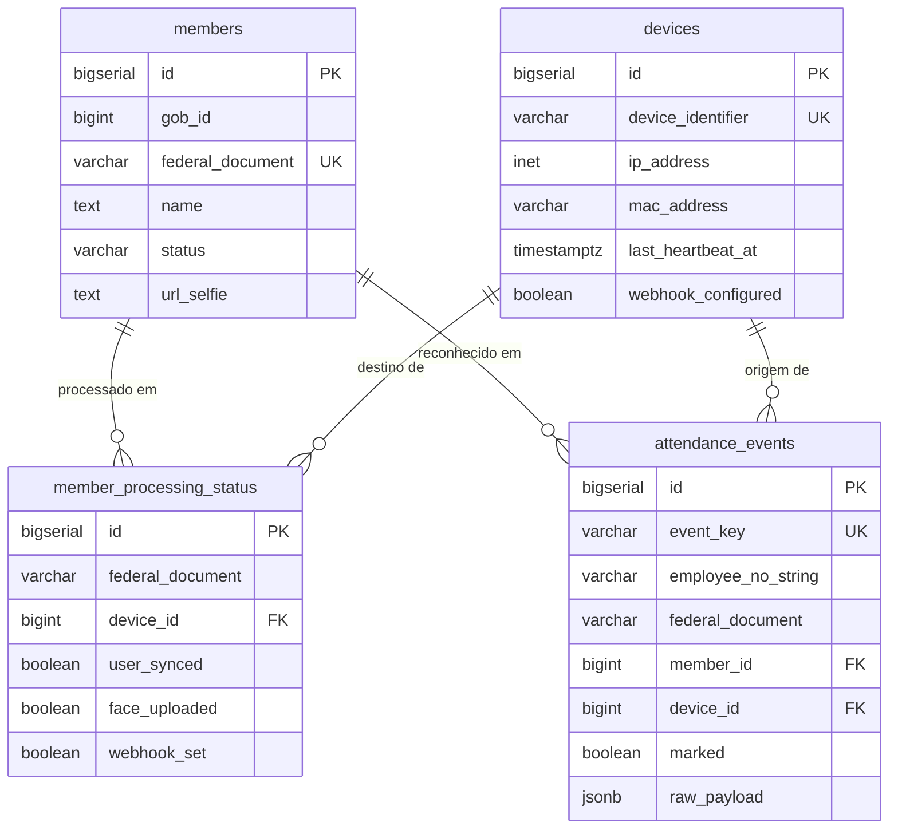

# Data Model — MVP de Controle de Presenca por Reconhecimento Facial

**Feature**: `presenca-facial-mvp` | **Date**: 2026-06-20
**Spec**: [spec.md](./spec.md) | **Plan**: [plan.md](./plan.md)

> Persistencia: PostgreSQL (Constitution — Stack). Identifiers em ingles
> (Constitution Principio VII). Idempotencia chaveada por CPF
> (Principio II). Campos derivados de contratos verificados (`t.txt`,
> `legacy/hik-api`) — nenhum campo factual externo inventado (Principio I).

## Visao geral

Quatro entidades persistidas + uma unidade de mensageria (nao persistida em
tabela, trafega no RabbitMQ):

| Entidade | Tabela | Origem | Chave natural |
|----------|--------|--------|---------------|
| Member | `members` | GOB (`/api/face-detection/members`) | `federal_document` (CPF) |
| Device | `devices` | Heartbeat HikVision | `device_identifier` |
| AttendanceEvent | `attendance_events` | Webhook HikVision | `event_key` |
| ProcessingOutcome | `member_processing_status` | Worker (estado da carga) | `federal_document` |
| ProcessingMessage | (RabbitMQ `member.processing`) | Carga | `federal_document` |

---

## Entity: Member

Pessoa fornecida pela GOB. Campos verificados em `t.txt:13-27` e `briefing.md:46-62`.

| Campo (DB, snake_case) | Tipo | Constraints | Origem GOB | Notas |
|------------------------|------|-------------|------------|-------|
| `id` | BIGSERIAL | PK | (interno) | PK local; NAO e o `id` da GOB |
| `gob_id` | BIGINT | NOT NULL | `data[].id` | id do membro na GOB |
| `federal_document` | VARCHAR(14) | NOT NULL, UNIQUE | `data[].federal_document` | CPF (digits) — chave de correlacao |
| `name` | TEXT | NOT NULL | `data[].name` | nome do membro |
| `status` | VARCHAR(32) | NOT NULL | `data[].status` | ex. `REGULAR` (`t.txt:18`) |
| `mobile_number` | VARCHAR(32) | NULL | `data[].mobile_number` | telefone |
| `url_selfie` | TEXT | NULL | `data[].url_selfie` | sem isso o membro nao e processado |
| `gob_created_at` | TIMESTAMPTZ | NULL | `data[].created_at` | timestamp da GOB |
| `gob_updated_at` | TIMESTAMPTZ | NULL | `data[].updated_at` | timestamp da GOB |
| `created_at` | TIMESTAMPTZ | NOT NULL DEFAULT now() | (interno) | |
| `updated_at` | TIMESTAMPTZ | NOT NULL DEFAULT now() | (interno) | |

**Indices/constraints**:
- `UNIQUE (federal_document)` — garante idempotencia da carga (Principio II).
- `INDEX (gob_id)`.

**Regras de validacao**:
- Membro com `url_selfie` ausente/vazio NAO e enfileirado (FR-006); pode ser
  persistido como referencia mas marcado como nao-processavel, ou simplesmente
  descartado da fila (decisao de execute-task — mas NUNCA enfileirado).
- `federal_document` invalido/ausente → membro descartado com log (Edge Case spec).

**State transitions**: Member nao tem maquina de estados propria; o estado de
processamento vive em `member_processing_status`.

---

## Entity: Device

Aparelho HikVision na rede local, identificado pelo heartbeat (FR-001/FR-002).

| Campo | Tipo | Constraints | Notas |
|-------|------|-------------|-------|
| `id` | BIGSERIAL | PK | |
| `device_identifier` | VARCHAR(64) | NOT NULL, UNIQUE | identificador estavel do heartbeat (ver nota) |
| `ip_address` | INET | NULL | IP observado no heartbeat/payload |
| `mac_address` | VARCHAR(17) | NULL | de `payload.macAddress` (`WebhookController.php:206`) |
| `last_heartbeat_at` | TIMESTAMPTZ | NULL | liveness |
| `is_active` | BOOLEAN | NOT NULL DEFAULT true | marcado ativo no primeiro heartbeat |
| `webhook_configured` | BOOLEAN | NOT NULL DEFAULT false | URL de webhook ja apontada para a API local |
| `created_at` | TIMESTAMPTZ | NOT NULL DEFAULT now() | primeira vez visto = registro (FR-001) |
| `updated_at` | TIMESTAMPTZ | NOT NULL DEFAULT now() | |

**Indices/constraints**:
- `UNIQUE (device_identifier)` — primeiro heartbeat insere; subsequentes fazem
  upsert (FR-002, sem duplicar).

> NOTA `[PROPOSTA — a validar na implementacao]`: o campo exato que identifica o
> dispositivo de forma estavel entre heartbeats (serial, MAC, ou um id no payload)
> NAO consta com granularidade no contrato verificado. O legacy loga
> `payload.macAddress` e `payload.ipAddress` (`WebhookController.php:205-206`). A
> implementacao deve preferir o identificador mais estavel disponivel no heartbeat
> real (MAC ou serial); ate la, `device_identifier` e derivado do MAC. Esta e
> decisao de implementacao marcada como proposta, NAO um campo factual inventado —
> o heartbeat real define o valor.

**State transitions**:
```
(inexistente) --primeiro heartbeat--> registered/active
registered/active --novo heartbeat--> active (last_heartbeat_at atualizado)
registered/active --webhook apontado--> webhook_configured=true
active --sem heartbeat por T (futuro)--> inactive   [PROPOSTA — liveness timeout pos-MVP]
```

---

## Entity: AttendanceEvent

Evento de reconhecimento recebido no webhook que resulta (ou nao) em marcacao de
presenca na GOB (FR-014..FR-017). Tabela serve para idempotencia (FR-016) e
auditoria.

| Campo | Tipo | Constraints | Origem | Notas |
|-------|------|-------------|--------|-------|
| `id` | BIGSERIAL | PK | | |
| `event_key` | VARCHAR(128) | NOT NULL, UNIQUE | derivado | dedup (ver regra) |
| `employee_no_string` | VARCHAR(32) | NOT NULL | `AccessControllerEvent.employeeNoString` | CPF bruto (dec-022) |
| `federal_document` | VARCHAR(14) | NULL | normalizado | CPF digits para correlacao |
| `member_id` | BIGINT | NULL, FK→members.id | correlacao | NULL = membro desconhecido |
| `device_id` | BIGINT | NULL, FK→devices.id | correlacao | |
| `event_datetime` | TIMESTAMPTZ | NULL | `payload.dateTime` / `AccessControllerEvent.dateTime` | |
| `attendance_status` | VARCHAR(32) | NULL | `attendanceStatus` (`WebhookEventProcessor.php:159`) | `authorized` = positivo |
| `marked` | BOOLEAN | NOT NULL DEFAULT false | (interno) | presenca enviada a GOB com sucesso |
| `marked_at` | TIMESTAMPTZ | NULL | (interno) | |
| `raw_payload` | JSONB | NOT NULL | payload bruto | auditoria/replay |
| `created_at` | TIMESTAMPTZ | NOT NULL DEFAULT now() | | |

**Indices/constraints**:
- `UNIQUE (event_key)` — re-entrega do mesmo evento e no-op (FR-016).
- `INDEX (federal_document)`, `INDEX (member_id)`.

**Regra de `event_key`** `[PROPOSTA — a validar na implementacao]`: hash de
`(employee_no_string, event_datetime, device_identifier)`. Se `event_datetime`
faltar, usar o instante de recebimento truncado + payload hash. A composicao exata
e detalhe de execute-task; o requisito firme e: re-entrega do mesmo evento fisico
nao gera segunda marcacao.

**State transitions**:
```
received --employeeNoString vazio OU membro desconhecido--> ignored (log, marked=false) [FR-017]
received --membro conhecido + authorized--> to_mark --POST GOB ok--> marked=true
to_mark --POST GOB falha--> retry/DLQ (Principio III); marked permanece false
```

---

## Entity: ProcessingOutcome (member_processing_status)

Estado da carga de um membro nos dispositivos (rastreabilidade / idempotencia da
Etapa 2). Opcional para o happy-path (a idempotencia ja vem do upsert ISAPI), mas
necessario para SC-005 (rastrear estagio de falha) e inspecao de DLQ.

| Campo | Tipo | Constraints | Notas |
|-------|------|-------------|-------|
| `id` | BIGSERIAL | PK | |
| `federal_document` | VARCHAR(14) | NOT NULL | CPF |
| `device_id` | BIGINT | NOT NULL, FK→devices.id | par membro×dispositivo |
| `user_synced` | BOOLEAN | NOT NULL DEFAULT false | upsert UserInfo/Modify ok |
| `face_uploaded` | BOOLEAN | NOT NULL DEFAULT false | faceDataRecord ok |
| `webhook_set` | BOOLEAN | NOT NULL DEFAULT false | httpHosts ok |
| `last_stage` | VARCHAR(32) | NULL | `user_sync`\|`face_upload`\|`webhook`\|`done` |
| `last_error` | TEXT | NULL | ultima falha (sem segredos — Principio V) |
| `attempts` | INT | NOT NULL DEFAULT 0 | tentativas acumuladas |
| `updated_at` | TIMESTAMPTZ | NOT NULL DEFAULT now() | |

**Indices/constraints**:
- `UNIQUE (federal_document, device_id)` — uma linha por par membro×dispositivo
  (idempotencia, Principio II).

---

## ProcessingMessage (RabbitMQ — nao tabela)

Unidade enfileirada na fila `member.processing` (uma por membro valido, FR-007).
Payload da mensagem (JSON, camelCase nas chaves — convencao de borda):

| Campo | Tipo | Origem | Notas |
|-------|------|--------|-------|
| `federalDocument` | string | Member | CPF (chave de idempotencia) |
| `name` | string | Member | nome |
| `urlSelfie` | string | Member | imagem a baixar e enviar |
| `gobId` | number | Member | id GOB (rastreio) |

Headers AMQP: `x-retry-count` (int). DLQ: `member.processing.dlq`.

---

## Diagrama de relacionamentos (ER)



## Migrations

Cada tabela e uma migration SQL versionada (ferramenta de migration a fixar em
execute-task — ex. `golang-migrate`, marcada PROPOSTA). Ordem: `members` →
`devices` → `member_processing_status` (FK device) → `attendance_events` (FK
member+device).
