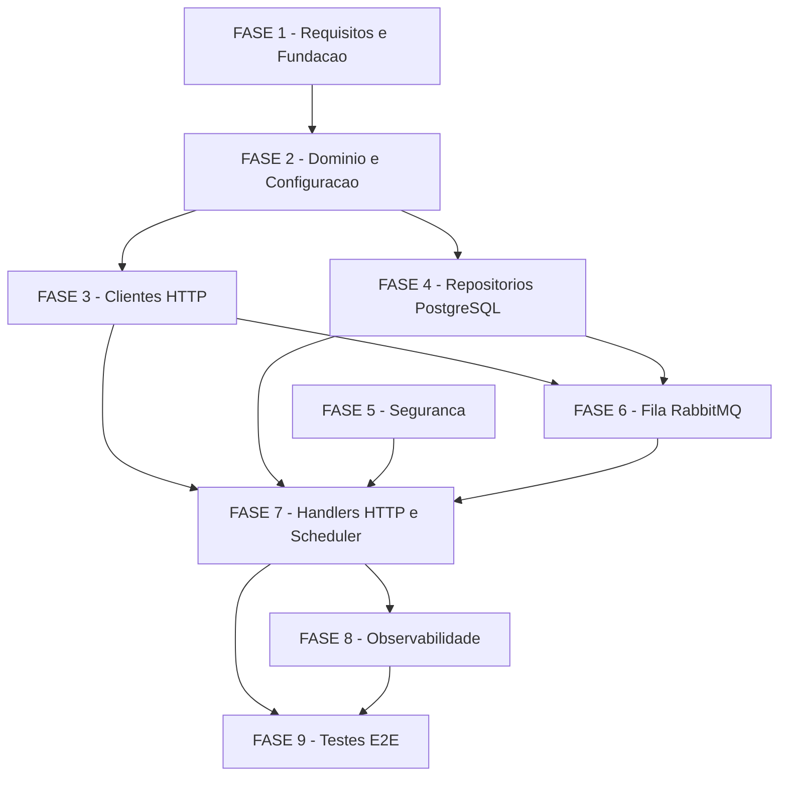

# Backlog de Tarefas: MVP de Controle de Presenca por Reconhecimento Facial

**Feature**: `presenca-facial-mvp`
**Spec**: [spec.md](./spec.md) | **Plan**: [plan.md](./plan.md) | **Data Model**: [data-model.md](./data-model.md)
**Created**: 2026-06-20
**Status**: Em Andamento

**Legenda de status:**
- `[ ]` Pendente
- `[~]` Em andamento
- `[x]` Concluido
- `[!]` Bloqueado

**Legenda de criticidade:**
- `[C]` Critico — impacto de seguranca, perda de dado ou SLA direto
- `[A]` Alto — funcionalidade core sem a qual o sistema nao opera
- `[M]` Medio — necessario mas pode ser adiado sem impacto imediato

---

## FASE 1 - Requisitos Residuais e Fundacao

> Resolve os gaps abertos no checklist (ambiguidades e items nao fechados) e
> estabelece a fundacao do projeto Go antes de implementar os dominios.
> Ref: checklists/api.md, security.md, integration.md.

### 1.1 Resolver ambiguidades de roteamento inbound `[A]`

Ref: checklists/api.md CHK018 (Ambiguity — path webhook vs heartbeat)

- [ ] 1.1.1 Analisar o payload real do heartbeat do DS-K1T673DWX para determinar se e possivel distingui-lo de um evento de webhook pelo `eventType` ou por path separado
- [ ] 1.1.2 Decidir e documentar a estrategia de roteamento: rota unica (distingue por `eventType`) vs. rotas separadas (`/webhook` e `/heartbeat`)
- [ ] 1.1.3 Registrar a decisao como comentario inline em `contracts/inbound-http.md §2 NOTA` e no `plan.md §Convencoes de Borda`
- [ ] 1.1.4 Atualizar `quickstart.md` Cenario 1 com o path exato do heartbeat

### 1.2 Resolver comportamento de atualizacao de face (url_selfie) `[A]`

Ref: checklists/integration.md CHK049 (Gap — comportamento de re-upload de face quando selfie muda)

- [ ] 1.2.1 Verificar no legacy `FaceService.php` se ha logica de deteccao de mudanca de face (comparacao de URL ou hash) antes de re-enviar
- [ ] 1.2.2 Definir o comportamento: (a) re-fazer upload sempre que o ciclo de carga enfileirar o membro, ou (b) rastrear hash/URL em `member_processing_status` e so re-enviar se mudou
- [ ] 1.2.3 Atualizar `spec.md §US3` e `data-model.md §ProcessingOutcome` com o comportamento definido (sem inventar — basear na analise do legacy ou na decisao explicita do operador)
- [ ] 1.2.4 Escrever teste que valida o comportamento escolhido para o cenario de re-upload

### 1.3 Definir comportamento de dispositivo inativo `[M]`

Ref: checklists/integration.md CHK039 (Gap — liveness timeout fora de scope)

- [ ] 1.3.1 Decidir se o MVP distribui membros para dispositivos sem heartbeat recente ou se o worker verifica `last_heartbeat_at` antes de processar
- [ ] 1.3.2 Documentar a decisao: (a) adicionar a `spec.md §Out of Scope` se o liveness timeout e pos-MVP, OU (b) adicionar FR na spec.md se o worker deve pular dispositivos offline
- [ ] 1.3.3 Atualizar `data-model.md §Device state transitions` com o comportamento documentado

### 1.4 Setup do projeto Go e infraestrutura local `[A]`

Ref: plan.md §Project Structure, §Technical Context

- [ ] 1.4.1 Inicializar `go.mod` com Go >= 1.22 e as dependencias primarias: `pgx` (ou `database/sql`), `amqp091-go`, cliente HTTP Digest (`github.com/icholy/digest` ou equivalente), ferramenta de migration
- [ ] 1.4.2 Criar estrutura de diretorios `cmd/presenca-facial/` e `internal/{config,http,gob,hikvision,scheduler,worker,queue,repository,domain,logging}/`
- [ ] 1.4.3 Criar `docker-compose.yml` com PostgreSQL e RabbitMQ (portas padrao, sem segredos hardcoded)
- [ ] 1.4.4 Configurar `Makefile` ou script de build com targets: `build`, `test`, `lint`, `migrate-up`, `migrate-down`
- [ ] 1.4.5 Verificar que `go build ./...` compila sem erro com a estrutura inicial (pacotes vazios com `package` declarado)

### 1.5 Migrations de banco de dados `[A]`

Ref: data-model.md §Migrations, plan.md §Technical Context (ferramenta de migration)

- [ ] 1.5.1 Criar migration `001_create_members.sql` com a tabela `members` (schema completo conforme data-model.md, UNIQUE em `federal_document`, INDEX em `gob_id`)
- [ ] 1.5.2 Criar migration `002_create_devices.sql` com a tabela `devices` (UNIQUE em `device_identifier`)
- [ ] 1.5.3 Criar migration `003_create_member_processing_status.sql` com FK para `devices` (UNIQUE em `federal_document, device_id`)
- [ ] 1.5.4 Criar migration `004_create_attendance_events.sql` com FKs para `members` e `devices` (UNIQUE em `event_key`, INDEX em `federal_document` e `member_id`)
- [ ] 1.5.5 Testar apply e rollback de todas as migrations em ordem e em reverso (sem erro de constraint)

---

## FASE 2 - Dominio, Configuracao e Logging

> Entidades, helpers de dominio (CPF, validacoes), leitura de env e logging estruturado.
> Ref: spec.md §Key Entities, plan.md §Mapper de CPF, §Convencoes de Borda.

### 2.1 Entidades de dominio `[A]`

Ref: spec.md §Key Entities, data-model.md

- [ ] 2.1.1 Implementar struct `Member` em `internal/domain/member.go` com campos: `ID`, `GobID`, `FederalDocument`, `Name`, `Status`, `MobileNumber`, `URLSelfie`, `GobCreatedAt`, `GobUpdatedAt`, `CreatedAt`, `UpdatedAt` (tipos Go idiomaticos, tags `json:"federal_document"` etc. conforme convencao de borda)
- [ ] 2.1.2 Implementar struct `Device` com campos: `ID`, `DeviceIdentifier`, `IPAddress`, `MACAddress`, `LastHeartbeatAt`, `IsActive`, `WebhookConfigured`, `CreatedAt`, `UpdatedAt`
- [ ] 2.1.3 Implementar struct `AttendanceEvent` com campos conforme data-model.md (incluindo `EventKey`, `EmployeeNoString`, `FederalDocument`, `MemberID`, `DeviceID`, `Marked`, `RawPayload`)
- [ ] 2.1.4 Implementar struct `ProcessingOutcome` (mapeamento de `member_processing_status`)
- [ ] 2.1.5 Implementar struct `ProcessingMessage` (payload da fila RabbitMQ — JSON camelCase: `federalDocument`, `name`, `urlSelfie`, `gobId`)
- [ ] 2.1.6 Escrever testes unitarios para verificar tags JSON de cada struct contra os nomes de campo das convencoes de borda (Principio I — sem drift silencioso)

### 2.2 Helper de CPF (fronteira critica — Principio II) `[C]`

Ref: plan.md §Mapper de CPF, spec.md §FR-008, §FR-022-INFRA-IDEMP

- [ ] 2.2.1 Implementar `internal/domain/cpf.go` com `FormatCPF(digits string) (masked string, err error)` — converte `12345678901` para `123.456.789-01`
- [ ] 2.2.2 Implementar `ParseCPF(masked string) (digits string, err error)` — converte mascara para digits
- [ ] 2.2.3 Implementar `ValidateCPF(input string) bool` — valida que o input tem exatamente 11 digitos apos limpeza de pontuacao (Ref: plan.md §S2 — regex 11 digitos)
- [ ] 2.2.4 Implementar `NormalizeCPF(input string) (digits string, err error)` — aceita digits ou mascara, retorna digits (para correlacao webhook↔membro, plan.md §Mapper de CPF)
- [ ] 2.2.5 Implementar `MaskCPFForLog(digits string) string` — retorna `***.***.***-NN` para logs (plan.md §S3, checklists/security.md CHK025)
- [ ] 2.2.6 Escrever testes unitarios cobrindo: formato valido, formato mascarado, CPF invalido (< 11 digitos, > 11 digitos, vazio), roundtrip digits→mascara→digits

### 2.3 Leitura de configuracao via env `[A]`

Ref: spec.md §FR-020, Constitution Principio V

- [ ] 2.3.1 Implementar `internal/config/config.go` com struct `Config` lendo: `GOB_STATE_URL`, `GOB_STATE_TOKEN`, `MEMBER_SYNC_INTERVAL_MINUTES` (default 60), `RETRY_MAX_ATTEMPTS` (default 3), `RETRY_INITIAL_BACKOFF_MS` (default 1000), `RUN_HTTP`, `RUN_SCHEDULER`, `RUN_WORKERS`, `ADMIN_TOKEN`, `WEBHOOK_PATH_SECRET`
- [ ] 2.3.2 Implementar leitura de credenciais ISAPI por dispositivo (ex: `ISAPI_DEVICE_{N}_HOST`, `ISAPI_DEVICE_{N}_USER`, `ISAPI_DEVICE_{N}_PASSWORD`) — formato exato a definir em 1.4
- [ ] 2.3.3 Garantir que `Config` falha com mensagem clara se variaveis obrigatorias estao ausentes (sem panic silencioso)
- [ ] 2.3.4 Escrever testes unitarios para `Config` com env vars presentes e ausentes

### 2.4 Logging estruturado JSON `[A]`

Ref: spec.md §FR-018, Constitution Principio VI

- [ ] 2.4.1 Implementar `internal/logging/logger.go` com wrapper sobre `log/slog` (stdlib Go >= 1.21) ou biblioteca equivalente, emitindo JSON com campos: `device_id`, `cpf` (mascarado), `stage`, `error`
- [ ] 2.4.2 Garantir que o campo `cpf` no logger sempre recebe a forma mascarada (chamar `MaskCPFForLog` antes de logar — nunca o CPF cru)
- [ ] 2.4.3 Garantir que segredos (`GOB_STATE_TOKEN`, senha ISAPI) nunca passam como argumento ao logger (Principio V)
- [ ] 2.4.4 Escrever testes que capturam a saida JSON e verificam: `cpf` esta mascarado, `stage` esta presente, nenhum campo contem o valor de `GOB_STATE_TOKEN` de teste

---

## FASE 3 - Clientes HTTP Externos (GOB e HikVision ISAPI)

> Clientes outbound contra GOB e ISAPI, sem side-effects no DB.
> Ref: contracts/gob-api.md, contracts/hikvision-isapi.md.

### 3.1 Cliente GOB — listagem de membros `[A]`

Ref: spec.md §FR-004, FR-005, contracts/gob-api.md §GET

- [ ] 3.1.1 Implementar `internal/gob/client.go` com metodo `ListMembers(ctx context.Context) ([]Member, error)` fazendo `GET {GOB_STATE_URL}/api/face-detection/members` com header `Authorization: Bearer {GOB_STATE_TOKEN}`
- [ ] 3.1.2 Deserializar a response como `{ "success": bool, "data": [ member ] }` usando os campos verificados de `contracts/gob-api.md §Campos verificados`
- [ ] 3.1.3 Retornar erro se `success != true` ou status HTTP != 2xx (sem publicar mensagens — FR-005, US2 cenario 3)
- [ ] 3.1.4 Detectar e tratar paginacao: se a response contiver campos de paginacao (ex: `page`, `total_pages`, `next_page_url`), buscar todas as paginas antes de retornar (Ref: checklists/api.md CHK006 — comportamento adaptativo, nao assumir ausencia de paginacao)
- [ ] 3.1.5 Escrever testes com stub HTTP: response valida (membros com e sem `url_selfie`), `success=false`, timeout, 500, e response com paginacao simulada

### 3.2 Cliente GOB — marcacao de presenca `[C]`

Ref: spec.md §FR-015, contracts/gob-api.md §POST attendance

- [ ] 3.2.1 Implementar `MarkAttendance(ctx context.Context, cpfDigits string) error` fazendo `POST {GOB_STATE_URL}/attendance/3ff4708cb695ad1a6e9f87cb714e1f22` com header `Authorization: {GOB_STATE_TOKEN}` (SEM Bearer) e body `{"cpf": "<formato mascarado>"}` (chamar `FormatCPF` antes de enviar)
- [ ] 3.2.2 Validar que o CPF passado tem 11 digitos antes de formatar e enviar (Ref: plan.md §S2)
- [ ] 3.2.3 Retornar erro em 4xx/5xx (a chamada de retry/DLQ e feita pelo caller — FR-023)
- [ ] 3.2.4 Escrever testes com stub: 200 sucesso, 4xx erro nao-retriable, 500 erro retriable, e verificar que o body enviado tem `cpf` no formato mascarado correto

### 3.3 Cliente HikVision ISAPI — upsert de usuario `[A]`

Ref: spec.md §FR-010, contracts/hikvision-isapi.md §1

- [ ] 3.3.1 Implementar `internal/hikvision/client.go` com `UpsertUser(ctx context.Context, deviceCfg DeviceConfig, cpfDigits string, name string) error` usando HTTP Digest
- [ ] 3.3.2 Tentar `POST /ISAPI/AccessControl/UserInfo/Modify` com XML `<UserInfo><employeeNo>{CPF}</employeeNo><name>{NAME}</name></UserInfo>`; se retornar 409 (usuario ja existe), fazer `PUT` com o mesmo body
- [ ] 3.3.3 Verificar campos opcionais do DS-K1T673DWX real (Ref: checklists/api.md CHK013): se o dispositivo rejeitar o XML minimo, adicionar campos necessarios (`userType`, `Valid`, `doorRight`) conforme resposta do dispositivo
- [ ] 3.3.4 Retornar erro em casos nao-retriable (ex: 400 malformed XML) vs retriable (5xx, timeout)
- [ ] 3.3.5 Escrever testes com stub ISAPI Digest: create 201, update 200, 204, falha transitoria 500, e verificar que o XML enviado contem os campos corretos

### 3.4 Cliente HikVision ISAPI — upload de face `[A]`

Ref: spec.md §FR-011, contracts/hikvision-isapi.md §2

- [ ] 3.4.1 Implementar `UploadFace(ctx context.Context, deviceCfg DeviceConfig, cpfDigits string, imageURL string) error`
- [ ] 3.4.2 Baixar a imagem de `imageURL` com timeout configuravel; falha de download → retornar erro (caller decide retry/DLQ — Edge Case spec)
- [ ] 3.4.3 Verificar mime type da imagem baixada: se nao for `image/jpeg`, logar com `stage=face_upload_mime_invalid` e retornar erro descritivo (Ref: checklists/security.md CHK031)
- [ ] 3.4.4 Montar multipart com parte `FaceDataRecord` (JSON `{"type":"concurrent","faceLibType":"blackFD","FDID":"1","FPID":"{CPF}"}`) e parte `FaceImage` (`{CPF}.jpg`, `image/jpeg`)
- [ ] 3.4.5 Fazer `POST /ISAPI/Intelligent/FDLib/faceDataRecord?format=json` com auth Digest; tratar 200 como sucesso
- [ ] 3.4.6 Escrever testes: download ok + upload 200, download 404 (erro), mime invalido (erro especifico), multipart com campos corretos verificados

### 3.5 Cliente HikVision ISAPI — configurar webhook `[A]`

Ref: spec.md §FR-012, contracts/hikvision-isapi.md §3

- [ ] 3.5.1 Implementar `ConfigureWebhook(ctx context.Context, deviceCfg DeviceConfig, webhookURL string) error`
- [ ] 3.5.2 Montar XML `<HttpHostNotification>` com todos os campos verificados: `id` (estavel por dispositivo — ex: hash do `device_identifier`), `url`, `protocolType=HTTP`, `parameterFormatType=XML`, `addressingFormatType=ipaddress`, `ipAddress`, `portNo`, `path` (incluindo o `WEBHOOK_PATH_SECRET` — Ref: plan.md §S1), `httpAuthenticationMethod=none`
- [ ] 3.5.3 Fazer `POST /ISAPI/Event/notification/httpHosts`; tratar 200/201 como sucesso
- [ ] 3.5.4 Garantir que o `id` do `HttpHostNotification` seja deterministico por dispositivo (sem acumular hosts duplicados a cada chamada)
- [ ] 3.5.5 Escrever testes: config 200, config 201, falha 500, e verificar que o XML contem o path-secret e todos os campos obrigatorios

---

## FASE 4 - Repositorios PostgreSQL

> Acesso ao banco com prepared statements, sem ORM. Mapper snake_case↔CamelCase explicito.
> Ref: plan.md §Mapper layer, data-model.md, plan.md §S2 (prepared statements).

### 4.1 Repository de Members `[A]`

Ref: data-model.md §Member, spec.md §FR-006, FR-007

- [ ] 4.1.1 Implementar `internal/repository/member_repository.go` com `Upsert(ctx, member Member) error` usando `INSERT ... ON CONFLICT (federal_document) DO UPDATE` com prepared statement (Ref: plan.md §S2)
- [ ] 4.1.2 Implementar `ListWithSelfie(ctx) ([]Member, error)` — retorna apenas membros com `url_selfie` nao-vazio
- [ ] 4.1.3 Implementar `FindByCPF(ctx, cpfDigits string) (*Member, error)` para correlacao no handler de webhook
- [ ] 4.1.4 Implementar mapper explicito Go struct ↔ PostgreSQL row (sem ORM auto-mapping — plan.md §Mapper layer)
- [ ] 4.1.5 Escrever testes de integracao com PostgreSQL real (Docker): upsert novo, upsert update, listagem com filtro selfie, find por CPF

### 4.2 Repository de Devices `[A]`

Ref: data-model.md §Device, spec.md §FR-001, FR-002, FR-003

- [ ] 4.2.1 Implementar `Upsert(ctx, device Device) error` — INSERT na primeira vez, UPDATE `last_heartbeat_at` nas subsequentes (ON CONFLICT em `device_identifier`)
- [ ] 4.2.2 Implementar `ListActive(ctx) ([]Device, error)` — retorna dispositivos com `is_active=true` (para distribuicao de membros — FR-003)
- [ ] 4.2.3 Implementar `FindByIdentifier(ctx, identifier string) (*Device, error)`
- [ ] 4.2.4 Escrever testes de integracao: primeiro heartbeat (insert), segundo heartbeat (update sem duplicar), listagem de ativos

### 4.3 Repository de AttendanceEvents `[C]`

Ref: data-model.md §AttendanceEvent, spec.md §FR-016 (dedup por event_key)

- [ ] 4.3.1 Implementar `InsertIfNotExists(ctx, event AttendanceEvent) (inserted bool, err error)` — INSERT com ON CONFLICT (event_key) DO NOTHING; retorna `inserted=false` se ja existia (dedup de re-entrega — FR-016)
- [ ] 4.3.2 Implementar `MarkAsMarked(ctx, eventKey string) error` — atualiza `marked=true, marked_at=now()`
- [ ] 4.3.3 Garantir que `raw_payload` e inserido como parametro JSONB (nunca interpolado — plan.md §S2)
- [ ] 4.3.4 Implementar `ComputeEventKey(employeeNoString string, eventDatetime time.Time, deviceIdentifier string) string` — hash deterministico (SHA-256 dos 3 campos; se `eventDatetime` vazio, usar hora de recebimento truncada + payload hash, conforme data-model.md §Regra de event_key)
- [ ] 4.3.5 Escrever testes: insert novo, insert duplicado (ON CONFLICT → inserted=false), mark as marked, e verificar event_key para diferentes combinacoes de inputs

### 4.4 Repository de ProcessingOutcome `[A]`

Ref: data-model.md §ProcessingOutcome, spec.md §FR-009, SC-005

- [ ] 4.4.1 Implementar `UpsertOutcome(ctx, outcome ProcessingOutcome) error` — INSERT ON CONFLICT (federal_document, device_id) DO UPDATE
- [ ] 4.4.2 Implementar `FindByMemberDevice(ctx, cpfDigits string, deviceID int64) (*ProcessingOutcome, error)`
- [ ] 4.4.3 Escrever testes: upsert novo par membro×dispositivo, upsert update, incremento de `attempts`

---

## FASE 5 - Seguranca (Findings S1-S5) [C]

> Todos os itens desta fase sao CRITICOS (plan.md §Security Considerations, Constitution Principio MUST).
> Nenhum finding HIGH pode ir para producao sem mitigacao.

### 5.1 Allowlist de IP + path-secret no webhook (S1) `[C]`

Ref: plan.md §S1, checklists/security.md CHK023 (Gap)

- [ ] 5.1.1 Implementar middleware `IPAllowlistMiddleware` que, para a rota de webhook, extrai o IP de origem do request e verifica contra `devices.ip_address` dos dispositivos registrados; rejeitar com 403 + log estruturado se IP nao esta na lista
- [ ] 5.1.2 Implementar `WEBHOOK_PATH_SECRET` como sufixo/segmento do path do webhook (configuravel via env — Principio V); validar que o path recebido bate com o path configurado antes de processar
- [ ] 5.1.3 Garantir que a URL configurada no `HttpHostNotification` (FASE 3 tarefa 3.5) inclui o path-secret
- [ ] 5.1.4 Escrever testes: request de IP autorizado (pass), request de IP nao-autorizado (403), path correto (pass), path incorreto (403/404)

### 5.2 Prepared statements e validacao de CPF (S2) `[C]`

Ref: plan.md §S2, checklists/security.md CHK028, CHK029

- [ ] 5.2.1 Auditar todos os repositorios da FASE 4 e garantir que NENHUMA query usa `fmt.Sprintf` ou concatenacao de string com dados externos — substituir por `$1, $2, ...` parametrizados
- [ ] 5.2.2 Garantir que `ValidateCPF` (FASE 2 tarefa 2.2.3) e chamada antes de qualquer uso de `employeeNoString` como `employeeNo`/`FPID`/`federal_document` em queries ou chamadas ISAPI
- [ ] 5.2.3 Garantir que `raw_payload` e armazenado como JSONB via parametro (nao como string interpolada)
- [ ] 5.2.4 Escrever teste de injecao: tentar inserir `federal_document` com SQL injection (ex: `'; DROP TABLE members; --`) e verificar que a query parametrizada nao e afetada

### 5.3 Mascaramento de CPF nos logs (S3) `[C]`

Ref: plan.md §S3, checklists/security.md CHK025, spec.md §FR-018

- [ ] 5.3.1 Auditar todos os pontos de logging (`internal/logging/`, handlers, worker, scheduler) e substituir qualquer referencia a CPF cru por `MaskCPFForLog(cpf)` (FASE 2 tarefa 2.2.5)
- [ ] 5.3.2 Adicionar lint rule ou teste de grep que busca por `federal_document`, `employeeNoString`, ou `cpf` sendo passados diretamente para o logger sem mascara
- [ ] 5.3.3 Escrever teste de integracao que verifica que os logs gerados pelo handler de webhook e pelo worker NAO contem o CPF no formato de 11 digitos

### 5.4 Rate limiting no webhook e /admin/sync (S4) `[C]`

Ref: plan.md §S4, checklists/security.md CHK024 (Gap)

- [ ] 5.4.1 Implementar rate limiting no handler de webhook por IP de origem: limite configuravel via env `WEBHOOK_RATE_LIMIT_PER_IP_PER_MIN` (default: 60 req/min por IP); rejeitar com 429 + log quando excedido
- [ ] 5.4.2 Implementar serializacao de `/admin/sync`: garantir que apenas um ciclo de carga rode por vez (ex: mutex ou flag de estado em memoria); retornar 409 se ja ha ciclo em andamento (ja previsto em contracts/inbound-http.md §4) + adicionar limite de frequencia via env `ADMIN_SYNC_MIN_INTERVAL_SECONDS` (default: 60)
- [ ] 5.4.3 Escrever testes: burst acima do limite → 429, ciclo duplicado → 409, ciclo sequencial → 202

### 5.5 Auth de /admin/* por token de admin (S5) `[C]`

Ref: plan.md §S5, checklists/security.md CHK021, spec.md §FR-020

- [ ] 5.5.1 Implementar middleware `AdminAuthMiddleware` que valida o header `Authorization: Bearer {ADMIN_TOKEN}` (lido de env `ADMIN_TOKEN`); retornar 401 se ausente, 403 se incorreto
- [ ] 5.5.2 Aplicar o middleware em todas as rotas `/admin/*` (deny-by-default — plan.md §S5)
- [ ] 5.5.3 Garantir que o `ADMIN_TOKEN` nunca aparece em logs (Principio V)
- [ ] 5.5.4 Implementar log de auditoria para `/admin/sync`: logar `stage=admin_sync_triggered`, `trigger_type=manual`, IP do caller (Ref: checklists/security.md CHK034)
- [ ] 5.5.5 Escrever testes: request sem token (401), token incorreto (403), token correto (202), e verificar que o log de auditoria e emitido sem expor o token

---

## FASE 6 - Fila RabbitMQ e Resiliencia

> Setup da fila, publisher e consumer com retry/DLQ.
> Ref: data-model.md §ProcessingMessage, spec.md §FR-007, FR-009, FR-023-INFRA-RETRY.

### 6.1 Setup de topologia RabbitMQ `[A]`

Ref: data-model.md §ProcessingMessage, plan.md §queue/

- [ ] 6.1.1 Implementar `internal/queue/setup.go` com `SetupTopology(conn AMQPConn) error` que declara: exchange principal, fila `member.processing`, DLX (dead-letter exchange), fila DLQ `member.processing.dlq` — idempotente (pode ser chamado multiplas vezes sem erro)
- [ ] 6.1.2 Configurar `x-dead-letter-exchange` e `x-dead-letter-routing-key` na fila principal para rotear para DLQ apos esgotar retries
- [ ] 6.1.3 Avaliar e documentar a estrategia de concorrencia de workers (Ref: checklists/integration.md CHK044): se dois workers podem processar o mesmo CPF simultaneamente, implementar prefetch count = 1 por worker OU lock por CPF via `member_processing_status` (decisao baseada na analise da FASE 1)
- [ ] 6.1.4 Escrever teste de integracao com RabbitMQ real (Docker): declarar topologia, publicar mensagem, verificar que a mensagem vai para DLQ apos N nacks

### 6.2 Publisher (producer) de mensagens `[A]`

Ref: spec.md §FR-007, data-model.md §ProcessingMessage

- [ ] 6.2.1 Implementar `internal/queue/publisher.go` com `Publish(ctx, msg ProcessingMessage) error` publicando JSON com chaves camelCase na fila `member.processing` (com `x-retry-count=0` no header AMQP)
- [ ] 6.2.2 Garantir que a publicacao e transacional ou que em caso de falha de conexao o erro e propagado ao caller (sem publicacoes parciais — US2 cenario 3)
- [ ] 6.2.3 Escrever teste: publicar mensagem valida, verificar payload JSON e headers AMQP

### 6.3 Consumer (worker) de mensagens com retry e DLQ `[A]`

Ref: spec.md §FR-009, FR-023-INFRA-RETRY, US3-cenario-5

- [ ] 6.3.1 Implementar `internal/worker/processor.go` com `ProcessMessage(ctx, delivery AMQPDelivery) error` que: extrai `ProcessingMessage`, executa as 3 operacoes ISAPI (tarefa 3.3, 3.4, 3.5) em sequencia, atualiza `member_processing_status` a cada passo
- [ ] 6.3.2 Implementar logica de retry: ao receber erro retriable, incrementar `x-retry-count` e re-publicar com backoff exponencial (`RETRY_INITIAL_BACKOFF_MS * 2^(count-1)`); quando `x-retry-count >= RETRY_MAX_ATTEMPTS`, fazer `Nack(requeue=false)` para rotear para DLQ
- [ ] 6.3.3 Garantir que erros nao-retriable (ex: CPF invalido, payload malformado) vao direto para DLQ sem retry (nao desperdicam tentativas em casos sem esperanca)
- [ ] 6.3.4 Garantir idempotencia: re-processar a mesma `ProcessingMessage` (mesmo CPF) produce o mesmo estado final (upsert ISAPI — US3 cenario 4)
- [ ] 6.3.5 Escrever testes: processamento bem-sucedido (member_processing_status atualizado), falha transitoria (N retries → DLQ), idempotencia de re-processamento

---

## FASE 7 - Handlers HTTP e Scheduler

> Camada de entrada (HTTP) e saida (scheduler de carga periodica).
> Ref: contracts/inbound-http.md, spec.md §FR-001/002/014-017/019/021-INFRA-SCHED.

### 7.1 Handler de heartbeat / registro de dispositivo `[A]`

Ref: spec.md §FR-001, FR-002, US4, contracts/inbound-http.md §2

- [ ] 7.1.1 Implementar handler para o path de heartbeat (decidido na FASE 1 tarefa 1.1): extrair `macAddress`/`ipAddress` do payload, derivar `device_identifier`, chamar `DeviceRepository.Upsert`
- [ ] 7.1.2 Retornar 200 sempre (como o webhook — dispositivo nao deve re-tentar em loop); logar erros internos sem expor detalhes ao device
- [ ] 7.1.3 Escrever testes: primeiro heartbeat (device criado), segundo heartbeat (device atualizado, sem duplicar), payload malformado (200 + log)

### 7.2 Handler de webhook de reconhecimento `[C]`

Ref: spec.md §FR-014..FR-017, contracts/inbound-http.md §1, plan.md §S1

- [ ] 7.2.1 Implementar handler para o path configurado pelo `WEBHOOK_PATH_SECRET`; extrair `employeeNoString` de `AccessControllerEvent` OU `EventNotificationAlert` (tolerante a ambos os shapes — contracts/inbound-http.md §1 Processamento)
- [ ] 7.2.2 Validar CPF por `ValidateCPF` + normalizar por `NormalizeCPF`; se invalido → log + 200 (nao crash)
- [ ] 7.2.3 Checar `attendanceStatus == "authorized"` + membro conhecido + event_key nao-duplicado antes de marcar presenca (FR-014..FR-017)
- [ ] 7.2.4 Chamar `GOBClient.MarkAttendance` com retry (FR-023); atualizar `attendance_events.marked`
- [ ] 7.2.5 Retornar 200 em todos os casos (sucesso, membro desconhecido, payload malformado — nao causar loop de retry no device)
- [ ] 7.2.6 Aplicar middleware de IP allowlist (FASE 5 tarefa 5.1) e rate limiting (FASE 5 tarefa 5.4) antes deste handler
- [ ] 7.2.7 Escrever testes: reconhecimento positivo (presenca marcada), membro desconhecido (200 sem marcacao), re-entrega (200 sem segunda marcacao), payload malformado (200), IP nao-autorizado (403)

### 7.3 Handler de health check `[M]`

Ref: spec.md §FR-019, contracts/inbound-http.md §3

- [ ] 7.3.1 Implementar `GET /health` que verifica conectividade com PostgreSQL (query simples) e RabbitMQ (channel open)
- [ ] 7.3.2 Retornar 200 `{"status":"ok","db":"ok","rabbitmq":"ok"}` se tudo ok; 503 `{"status":"degraded","db":"error","rabbitmq":"ok"}` se alguma dependencia falhou
- [ ] 7.3.3 Escrever testes: DB ok (200), DB down (503), RabbitMQ down (503)

### 7.4 Handler /admin/sync e scheduler de carga `[A]`

Ref: spec.md §FR-021-INFRA-SCHED, contracts/inbound-http.md §4

- [ ] 7.4.1 Implementar `POST /admin/sync` com middleware de auth (FASE 5 tarefa 5.5) + serializacao (FASE 5 tarefa 5.4): acionar o mesmo codigo do scheduler de carga, retornar 202 ou 409
- [ ] 7.4.2 Implementar `internal/scheduler/loader.go` com `RunMemberLoadCycle(ctx) error`: chamar `GOBClient.ListMembers`, filtrar por `url_selfie`, publicar `ProcessingMessage` para cada membro valido via `Publisher.Publish`
- [ ] 7.4.3 Implementar ticker periodico que chama `RunMemberLoadCycle` a cada `MEMBER_SYNC_INTERVAL_MINUTES` (ativavel por `RUN_SCHEDULER=true`)
- [ ] 7.4.4 Escrever testes: ciclo completo (GOB → filtro → fila), ciclo com GOB indisponivel (sem publicacoes parciais), ciclo duplicado serializado (409)

---

## FASE 8 - Observabilidade e Operacoes

> Logs estruturados completos, health check, quickstart e runbook basico.
> Ref: spec.md §FR-018, SC-005, quickstart.md.

### 8.1 Auditoria de logging estruturado `[A]`

Ref: spec.md §FR-018, SC-005

- [ ] 8.1.1 Garantir log estruturado em TODAS as operacoes criticas com os 4 campos obrigatorios: `device_id`, `cpf` (mascarado), `stage`, `error`
- [ ] 8.1.2 Definir e documentar os valores de `stage` usados: `heartbeat_received`, `member_load_started`, `member_load_completed`, `member_enqueued`, `worker_processing`, `user_synced`, `face_uploaded`, `webhook_configured`, `attendance_event_received`, `attendance_marked`, `attendance_deduped`, `attendance_unknown_member`, `dlq_routed`
- [ ] 8.1.3 Escrever teste de fumaca que roda o cenario roundtrip (quickstart Cenario 5) e verifica que todos os stages aparecem nos logs sem CPF exposto

### 8.2 Ambiente de desenvolvimento e quickstart `[M]`

Ref: quickstart.md, plan.md §docker-compose

- [ ] 8.2.1 Finalizar `docker-compose.yml` com PostgreSQL, RabbitMQ e (opcional) stub HTTP para GOB + ISAPI
- [ ] 8.2.2 Criar `.env.example` com todas as variaveis de `Config` e valores de exemplo (sem segredos reais — Principio V)
- [ ] 8.2.3 Criar `Makefile` target `quickstart` que: sobe docker-compose, aplica migrations, compila e roda o binario com as 3 flags ativas, executa os 5 cenarios de quickstart.md

---

## FASE 9 - Testes de Integracao e Validacao End-to-End

> Roundtrip E2E contra stubs reais, anti-drift de payload, cenarios do quickstart.
> Ref: quickstart.md, spec.md §Success Criteria.

### 9.1 Testes de integracao por fluxo `[A]`

Ref: quickstart.md §Cenario 1-4, spec.md §SC-001..SC-006

- [ ] 9.1.1 Implementar teste de integracao para Cenario 1 (registro de dispositivo via heartbeat): verificar insert + upsert sem duplicar
- [ ] 9.1.2 Implementar teste de integracao para Cenario 2 (carga de membros): verificar filtro por `url_selfie`, publicacao de 1 mensagem, nenhuma publicacao em GOB down
- [ ] 9.1.3 Implementar teste de integracao para Cenario 3 (worker ISAPI): stub ISAPI real, verificar 3 operacoes, idempotencia, DLQ em falha persistente
- [ ] 9.1.4 Implementar teste de integracao para Cenario 4 (webhook de presenca): stub GOB real, verificar marcacao, dedup, membro desconhecido, GOB down → DLQ
- [ ] 9.1.5 Verificar latencia do fluxo webhook → presenca marcada <= 5s (SC-002) no ambiente de teste

### 9.2 Teste roundtrip anti-drift (Cenario 5) `[C]`

Ref: quickstart.md §Cenario 5, plan.md §Principio II

- [ ] 9.2.1 Implementar stub HTTP que grava todas as requests recebidas (GOB attendance + ISAPI)
- [ ] 9.2.2 Rodar fluxo completo (carga → worker → webhook) com um membro de ponta a ponta; capturar requests gravadas pelo stub
- [ ] 9.2.3 Verificar anti-drift: XML `UserInfo/Modify` usa tag `<employeeNo>` (nao `<employeeNoString>`); `FPID` no `faceDataRecord` == CPF do membro; `cpf` no body da marcacao GOB esta no formato mascarado; CPF do `employeeNoString` recebido == CPF enviado para GOB (normalizado para digits)
- [ ] 9.2.4 Qualquer divergencia de campo/formato deve FALHAR o teste (zero tolerancia a drift — Principio II)

---

## Matriz de Dependencias

---

## Resumo Quantitativo

| FASE | Nome | Tarefas | Subtarefas | Critico [C] | Alto [A] | Medio [M] |
|------|------|---------|------------|-------------|----------|-----------|
| 1 | Requisitos e Fundacao | 5 | 21 | 0 | 4 | 1 |
| 2 | Dominio e Configuracao | 4 | 20 | 1 | 3 | 0 |
| 3 | Clientes HTTP | 5 | 26 | 1 | 4 | 0 |
| 4 | Repositorios PostgreSQL | 4 | 18 | 1 | 3 | 0 |
| 5 | Seguranca | 5 | 22 | 5 | 0 | 0 |
| 6 | Fila RabbitMQ | 3 | 13 | 0 | 3 | 0 |
| 7 | Handlers HTTP e Scheduler | 4 | 19 | 1 | 2 | 1 |
| 8 | Observabilidade | 2 | 6 | 0 | 1 | 1 |
| 9 | Testes E2E | 2 | 9 | 1 | 1 | 0 |
| **Total** | | **34** | **154** | **10 [C]** | **21 [A]** | **3 [M]** |

---

## Escopo Coberto

- Setup completo do projeto Go (go.mod, estrutura, docker-compose, Makefile)
- Migrations PostgreSQL para as 4 entidades (members, devices, attendance_events, member_processing_status)
- Entidades de dominio com tipagem correta e testes de tags JSON
- Helper de CPF completo (format, parse, validate, normalize, mask para log)
- Configuracao via env com validacao de variaveis obrigatorias
- Logging estruturado JSON com mascaramento de PII (CPF)
- Cliente GOB: listagem de membros (com deteccao adaptativa de paginacao) e marcacao de presenca
- Cliente HikVision ISAPI: upsert de usuario, upload de face (com validacao de mime type), configuracao de webhook
- Repositorios PostgreSQL com prepared statements (sem ORM)
- Seguranca: allowlist de IP + path-secret no webhook, rate limiting, auth /admin/*, mascaramento PII, log de auditoria
- Topologia RabbitMQ (fila + DLX/DLQ), publisher, consumer com retry exponencial e DLQ
- Handlers HTTP: heartbeat, webhook (com middleware de seguranca), health check, /admin/sync
- Scheduler periodico de carga de membros
- Testes unitarios e de integracao por fluxo (Cenarios 1-4 do quickstart)
- Teste roundtrip anti-drift (Cenario 5) com stub real e verificacao de payload

## Escopo Excluido

- Interface web de administracao (spec.md §Out of Scope)
- Gerenciamento de jornadas/horarios / ponto eletronico completo (spec.md §Out of Scope)
- Integracao com sistemas de RH alem da GOB (spec.md §Out of Scope)
- Suporte a multiplas organizacoes (spec.md §Out of Scope)
- Cadastro manual de membros (spec.md §Out of Scope)
- Abstracao multi-fornecedor de biometria — HikVision e o unico fornecedor no MVP (spec.md §Out of Scope)
- Liveness timeout de dispositivos (pos-MVP — definir na FASE 1 tarefa 1.3 o comportamento default)
- HTTPS nas chamadas ISAPI (risco residual S6 aceito para MVP on-premise — plan.md §S6)
- Dashboard de metricas / alertas automaticos (pos-MVP)
- CI/CD (fora do escopo do backlog; infraestrutura do operador)
- Certificados TLS para a API local (deploy on-premise, fora do escopo do MVP)
